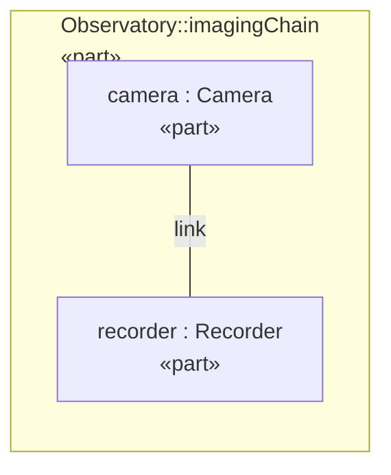
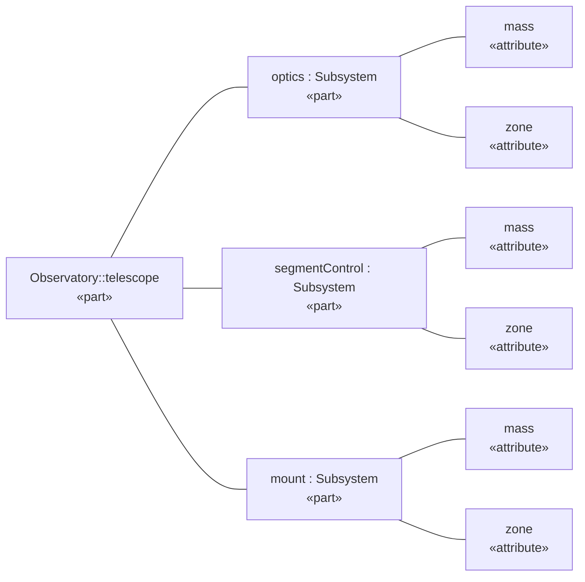

# Telescope Mass Report

Mass rollup and requirement status for the telescope assembly.

This report is *generated* from the model by `sysml -render-document` [(OpenSysML)](<https://opensysml.org/>) — masses are tabulated in [Subsystem Masses](#breakdown)

## Subsystem Masses

<!-- caption -->
*All subsystems by mass*

| name | mass |
| --- | --- |
| mount | 15 |
| optics | 8.5 |
| segmentControl | 20 |

<!-- caption -->
*Subsystems grouped by zone*

**zone: support**

| zone | name | mass |
| --- | --- | --- |
| support | mount | 15 |

**zone: payload**

| zone | name | mass |
| --- | --- | --- |
| payload | optics | 8.5 |
| payload | segmentControl | 20 |

### Heavy Subsystems

Subsystems at or above 10 kg:

1. mount
2. segmentControl

## Mass Requirement

<!-- caption -->
*Parts satisfying the mass requirement*

| name | qualifiedName |
| --- | --- |
| telescope | Observatory::telescope |

<!-- caption -->
*Verifications of the mass requirement*

| qualifiedName |
| --- |
| Observatory::massVerification |

## Diagrams

<!-- caption -->
*Imaging chain interconnection*

<!-- caption -->
*Telescope part tree, left to right*

