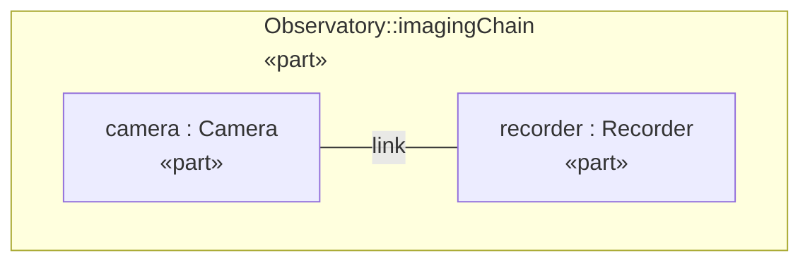
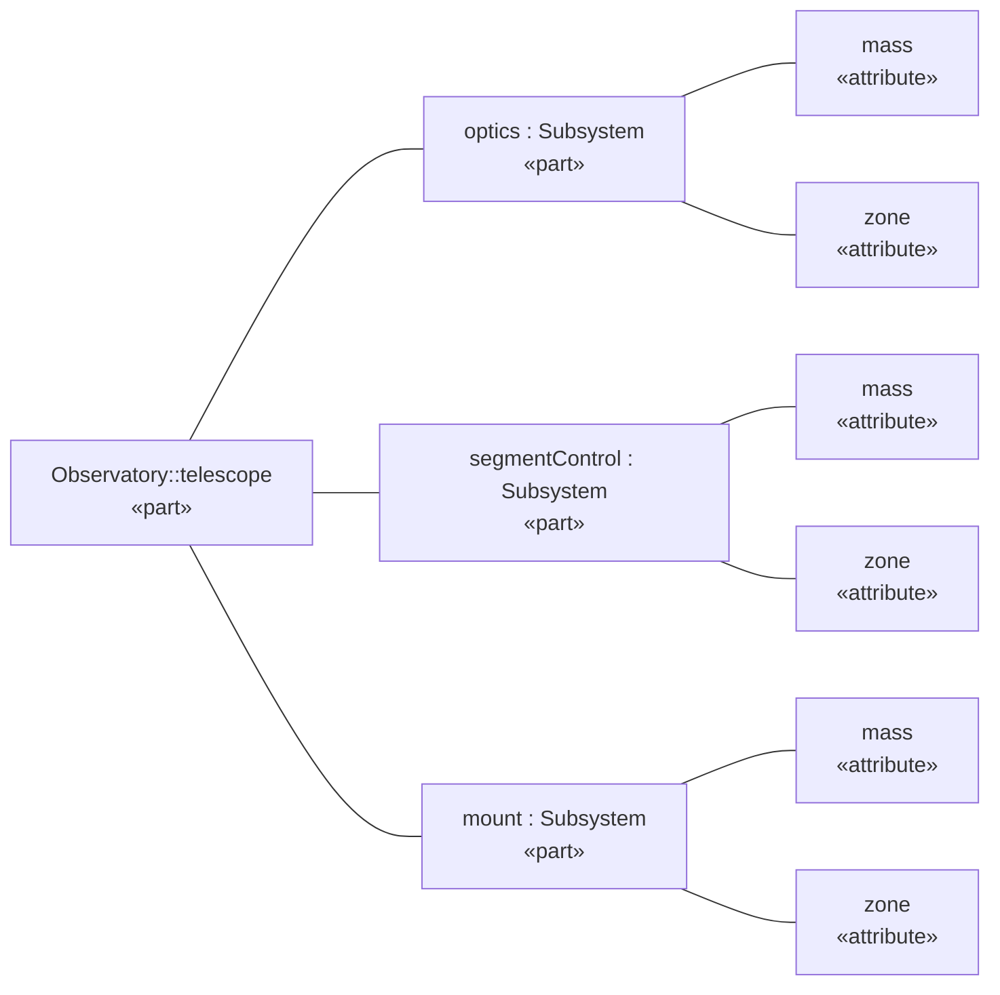

# A Complete Worked Example

This chapter is one report, whole: a telescope mass report exercising most of
what the previous chapters covered — descendant collection, type and property
filters, ordering, projection, query-invokes-query, relationship traversal
for satisfy and verify, sections, static and inline-run paragraphs with a
link and a cross-reference, plain and grouped tables, a numbered list, and
two diagrams (a declared view and a plain element with a stated kind and
direction).

Both files below are committed in this repository and kept in lockstep by a
test that re-renders the source and compares against the committed output —
so what you read here is exactly what the current binary produces.

- Source: [`examples/observatory.sysml`](examples/observatory.sysml)
- Rendered output: [`examples/observatory.md`](examples/observatory.md)

Render it yourself from the repository root:

```console
$ sysml docs/manual/examples/observatory.sysml \
    -render-document Observatory::MassReport -o observatory.md
```

or as [semantic HTML](outputs.md#html), with a stylesheet of your own after the
default one:

```console
$ sysml docs/manual/examples/observatory.sysml \
    -render-document Observatory::MassReport \
    -doc-form html -doc-toc -html-css theme.css -o observatory.html
```

or as a PDF ([how inline runs and anchors render](outputs.md#pdf-rendering-of-inline-runs-and-anchors)):

```console
$ sysml docs/manual/examples/observatory.sysml \
    -render-document Observatory::MassReport \
    -doc-form pdf -doc-title-page -doc-toc -doc-number-sections \
    -o observatory.pdf
```

## The full source

```sysml
package Observatory {
	private import DocumentQueries::*;
	private import KerML::Root::Element;
	private import ScalarValues::*;
	private import Views::*;

	// ---- The system model the report is generated from ----

	part def Subsystem {
		attribute mass : Real;
		attribute zone : String;
	}

	part telescope {
		part optics : Subsystem {
			attribute redefines mass = 8.5;
			attribute redefines zone = "payload";
		}
		part segmentControl : Subsystem {
			attribute redefines mass = 20.0;
			attribute redefines zone = "payload";
		}
		part mount : Subsystem {
			attribute redefines mass = 15.0;
			attribute redefines zone = "support";
		}
	}

	port def DataPort;

	part def Camera {
		port output : DataPort;
	}

	part def Recorder {
		port input : DataPort;
	}

	part imagingChain {
		part camera : Camera;
		part recorder : Recorder;
		connection link connect camera.output to recorder.input;
	}

	requirement massRequirement;
	part observatory {
		satisfy massRequirement by telescope;
	}

	verification def MassTest;
	verification massVerification : MassTest {
		objective {
			verify massRequirement;
		}
	}

	view interconnectView {
		expose imagingChain;
		render asInterconnectionDiagram;
	}

	// ---- Document queries ----

	calc def Subsystems :> Query {
		in root : Element;
		WhereType(
			source = Descendants(source = root, maxDepth = 3),
			type = "PartUsage"
		)
	}

	calc def SubsystemTable :> Query {
		in root : Element;
		Project(
			source = OrderBy(
				source = Subsystems(root = root),
				property = "name",
				direction = "ascending",
				missing = "last",
				multiple = "error"
			),
			properties = ("name", "mass")
		)
	}

	calc def HeavySubsystemNames :> Query {
		in root : Element;
		in threshold : String;
		Project(
			source = OrderBy(
				source = WhereFeature(
					source = Subsystems(root = root),
					'feature' = "mass",
					operator = ">=",
					value = threshold
				),
				property = "name",
				direction = "ascending",
				missing = "last",
				multiple = "error"
			),
			properties = ("name")
		)
	}

	calc def ZonedSubsystems :> Query {
		in root : Element;
		Project(
			source = OrderBy(
				source = Subsystems(root = root),
				property = "name",
				direction = "ascending",
				missing = "last",
				multiple = "error"
			),
			properties = ("zone", "name", "mass")
		)
	}

	calc def SatisfyingParts :> Query {
		in req : Element;
		Project(
			source = RelatedElements(
				source = req,
				relationshipKind = "satisfaction",
				direction = "incoming",
				maxDepth = 1
			),
			properties = ("name", "qualifiedName")
		)
	}

	calc def VerifyingElements :> Query {
		in req : Element;
		Project(
			source = RelatedElements(
				source = req,
				relationshipKind = "verification",
				direction = "incoming",
				maxDepth = 1
			),
			properties = ("qualifiedName")
		)
	}

	// ---- The document definition ----

	part def MassReport :> Document {
		attribute redefines title = "Telescope Mass Report";

		part intro : Paragraph {
			attribute redefines text = "Mass rollup and requirement status for the telescope assembly.";
		}

		part guide : Paragraph {
			part lead : Span {
				attribute redefines text = "This report is";
			}
			part generated : Span {
				attribute redefines text = "generated";
				attribute redefines style = "emphasis";
			}
			part sourceNote : Span {
				attribute redefines text = "from the model by";
			}
			part tool : Span {
				attribute redefines text = "sysml -render-document";
				attribute redefines style = "code";
			}
			part docsLink : Link {
				attribute redefines text = "(OpenSysML)";
				attribute redefines target = "https://opensysml.org/";
			}
			part see : Span {
				attribute redefines text = "— masses are tabulated in";
			}
			part massesRef : Ref {
				ref redefines target = breakdown;
			}
		}

		part breakdown : Section {
			attribute redefines title = "Subsystem Masses";

			part masses : Table {
				attribute redefines caption = "All subsystems by mass";
				calc rows : SubsystemTable {
					in root = telescope;
				}
			}

			part zones : Table {
				attribute redefines caption = "Subsystems grouped by zone";
				attribute redefines groupBy = "zone";
				calc rows : ZonedSubsystems {
					in root = telescope;
				}
			}

			part heavy : Section {
				attribute redefines title = "Heavy Subsystems";

				part note : Paragraph {
					attribute redefines text = "Subsystems at or above 10 kg:";
				}

				part heavyItems : List {
					attribute redefines style = "number";
					calc items : HeavySubsystemNames {
						in root = telescope;
						in threshold = "10";
					}
				}
			}
		}

		part requirements : Section {
			attribute redefines title = "Mass Requirement";

			part satisfiers : Table {
				attribute redefines caption = "Parts satisfying the mass requirement";
				calc rows : SatisfyingParts {
					in req = massRequirement;
				}
			}

			part verifiers : Table {
				attribute redefines caption = "Verifications of the mass requirement";
				calc rows : VerifyingElements {
					in req = massRequirement;
				}
			}
		}

		part diagrams : Section {
			attribute redefines title = "Diagrams";

			part imaging : Diagram {
				attribute redefines caption = "Imaging chain interconnection";
				ref redefines source = interconnectView;
			}

			part structure : Diagram {
				attribute redefines caption = "Telescope part tree, left to right";
				attribute redefines kind = "tree";
				attribute redefines direction = "LR";
				ref redefines source = telescope;
			}
		}
	}
}
```

## The full rendered output

````markdown
# Telescope Mass Report

Mass rollup and requirement status for the telescope assembly.

This report is *generated* from the model by `sysml -render-document` [(OpenSysML)](<https://opensysml.org/>) — masses are tabulated in [Subsystem Masses](#breakdown)

<a id="breakdown"></a>

## Subsystem Masses

*All subsystems by mass*

| name | mass |
| --- | --- |
| mount | 15 |
| optics | 8.5 |
| segmentControl | 20 |

*Subsystems grouped by zone*

**zone: support**

| zone | name | mass |
| --- | --- | --- |
| support | mount | 15 |

**zone: payload**

| zone | name | mass |
| --- | --- | --- |
| payload | optics | 8.5 |
| payload | segmentControl | 20 |

### Heavy Subsystems

Subsystems at or above 10 kg:

1. mount
2. segmentControl

## Mass Requirement

*Parts satisfying the mass requirement*

| name | qualifiedName |
| --- | --- |
| telescope | Observatory::telescope |

*Verifications of the mass requirement*

| qualifiedName |
| --- |
| Observatory::massVerification |

## Diagrams

*Imaging chain interconnection*



*Telescope part tree, left to right*


````

## Reading it back

A few details worth pausing on:

- **The group order differs from the row order.** Rows sort by name (mount,
  optics, segmentControl), so `support` is the first zone encountered and
  its subtable comes first — group order is order of first appearance.
- **`WhereType` + `Descendants` is the collection idiom**: `Subsystems`
  collects part usages under a root once, and four other queries reuse it by
  invocation with different filters and projections.
- **The cross-reference resolves to the section's title.** `massesRef` names
  no text, so it renders as the target's title, linked to the anchor emitted
  before the section.
- **`mount` renders as `15`, not `15.0`** — reals render in shortest
  notation.
- **The traversal queries feed tables.** `SatisfyingParts` and
  `VerifyingElements` are the cookbook's satisfy/verify recipes with a
  `Project` on the end — one table per requirement, with `req` bound. A
  single matrix over every requirement is a `Project` whose `columns` are
  `RelatedColumn(...)` entries; see the cookbook's
  [traceability matrix](query-cookbook.md#traceability-matrix) recipe and
  the [traceability example](examples/traceability.md) built on it.
