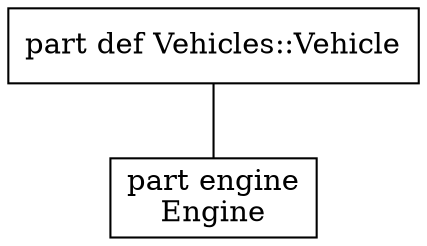
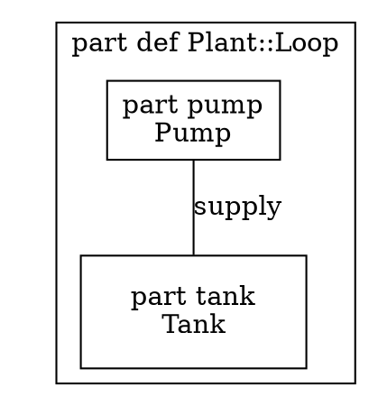

# View rendering forms — the view engine's writers

> **Labels.** This is an engineering record. "Track W" and its items (`W1`–`W3`) name entries of
> [the roadmap](roadmap.md), where each is stated in full; a reader who only wants the design can
> ignore them.

Status: **`text`, `markdown`, `mermaid` and `dot` implemented** — `dot` is Track W's `W1`, wired
into every surface `W3` names. `plantuml` (`W2`) is not written. This page records how a view's
rendering is separated from the forms it is written in, why Graphviz DOT is offered next to
Mermaid, and what the DOT writer emits — the [DiagramLayout](diagram-layout-annotations.md) geometry
included.

## The rendering and its forms

A view renders into a `view.Rendering` (`internal/core/view/view.go`): the kind (`tree`,
`interconnection`, `state`, `action`, `sequence`, `table`), typed nodes with an identifier, a
kind, a name, an optional detail and their children, edges with a label and an `EdgeKind`
(connection, transition, succession, flow), a table's columns and rows, the origin of every node
and row, and notices for what the kind could not represent. The tree, interconnection, state and
action kinds are produced from the model — the last two from the lowered `StateGraph` and
`ActionGraph` the runtime executes — and nothing in the rendering is text of any diagram
language.

A **form** is a writer over that tree (`internal/core/view/form.go`):

| Form | Writer | Kinds | Role |
| --- | --- | --- | --- |
| `text` | `text.go` | every kind | What a person reads at a terminal |
| `markdown` | `markdown.go` | `table` | The machine-readable form of a table |
| `mermaid` | `mermaid.go` | `tree`, `interconnection`, `state`, `action`, `sequence` | The default machine-readable form of the graph-shaped kinds |
| `dot` | `dot.go` | `tree`, `interconnection`, `state`, `action` | Graphviz DOT, the alternative to Mermaid |

`Kind.MachineForm` chooses the form a tool gets when none is asked for — `markdown` for a table,
`mermaid` for everything else — and `Kind.SupportsForm` decides whether a kind can be written in
a form at all. Asking for a form the kind is not written in is one typed `WrongFormError`, naming
the kind, the form asked and the form the kind uses, on every surface: the CLI stops with status 2
(`-render-all` skips the view and says so), the REPL prints the usage, the LSP refuses the request,
and a document's `Diagram` block is refused at planning time.

## Why DOT next to Mermaid

Mermaid was chosen first because it draws where models are read — Markdown, documentation sites,
editors — with nothing installed. It stays the default. DOT is offered beside it for what Mermaid
is not:

- **Graphviz toolchains.** Publishing pipelines that already run `dot`, `neato` or `fdp` take DOT
  as input and produce SVG, PDF or PNG with a layout Mermaid's browser renderer cannot match on a
  graph of hundreds of nodes.
- **Exact positions.** DOT has a native vocabulary for a node's position (`pos`), size and an
  edge's route, which Mermaid lacks. The writer fills it from the rendering's DiagramLayout
  geometry (below), so a view laid out in an editor is drawn by Graphviz where the editor put
  it; the Mermaid form can only carry the same numbers as `%%` comments.

Producing DOT needs **no Graphviz installation**. The writer is text over the rendering tree,
exactly as `mermaid.go` is, and nothing in the repository runs a Graphviz binary — not the writer,
not the tests, not the PDF backend.

## What the DOT writer emits



- **Header.** `// view: <name>` when a view was named, `// kind: <kind>`, `// stated: <how the
  kind was decided>` when the rendering records it, one `// not represented: <notice>` per
  notice — the same facts the Mermaid form writes as `%%` comments — and `// layout: dot`.
- **Graph.** `digraph "<view>"` (`digraph` alone for a pseudo-view), `graph [rankdir=<dir>]` when
  a direction is asked for and nothing when it is not, `node [shape=box]`, and `compound=true`
  only when an edge ends at a cluster.
- **Nodes.** A leaf is `"<id>" [label="<name>\n<detail>"]`, the detail line omitted when empty.
  In an interconnection, state or action rendering a node with children is
  `subgraph "cluster_<id>" { label="<name>"; … }`, the containment Mermaid writes as `subgraph`;
  in a tree, containment is an `arrowhead=none` edge, as the Mermaid tree draws it, so a tree has
  no clusters. Since DOT edges join nodes, not subgraphs, every cluster holds an invisible,
  sizeless anchor node named by the cluster's own ID; an edge whose end is a cluster names that
  anchor, so the rendering's endpoints survive verbatim, and is clipped at the cluster with
  `lhead`/`ltail` — except at an end that encloses the other, where the edge starts or ends
  inside it rather than at a border it never crosses.
- **State kind.** A state is a rounded box, a region a dashed cluster, the start pseudo-state a
  `point`, an initial state a `circle`, a final state a `doublecircle`; a transition's label is the
  trigger/guard/effect text the state writer composes, unchanged.
- **Edges.** The `EdgeKind` styles parallel the Mermaid arrows so the two forms read alike:

  | `EdgeKind` | Mermaid | DOT |
  | --- | --- | --- |
  | connection | `---` | `arrowhead=none` |
  | transition, succession | `-->` | solid, default arrowhead |
  | flow | `-.->` | `style=dashed` |

- **Quoting.** Every identifier and label passes through one helper that double-quotes it and
  escapes `"`, `\` and newlines; the writer never emits an unquoted identifier.
- **Order.** Nodes and edges are written in the rendering's order; nothing is emitted from a map.

Three methods of the writer produce every attribute list — `graphAttributes`,
`dotNodeAttributes` (with `dotClusterAttributes` and `dotAnchorAttributes` for a node drawn as a
cluster) and `dotEdgeAttributes` — so what is said about a node or an edge changes without
touching how the graph is walked.

## Geometry

A rendering carries the [DiagramLayout](diagram-layout-annotations.md) annotations of its view — a
`Rendering.Canvas`, a `Node.Geometry`, an `Edge.Route` — in the library's units: pixels,
y down, origin at the canvas's top-left corner. Graphviz reads points, y up, from the
bottom-left; the writer converts, so the DOT it writes is laid out by Graphviz without a
preprocessing step:



- **Scale.** One pixel is one point: `inputscale=72` tells `neato` that `pos` is in points, and
  `dpi=72` keeps the rendered pixel at that size. Lengths Graphviz takes in inches — a node's
  `width`/`height` — are divided by 72.
- **Axis.** `y` is flipped: measured up from the canvas's bottom edge (`height - y`) when the
  canvas states a height, negated when it does not. `x` is unchanged.
- **Canvas.** A `Canvas` is echoed in the header as `// canvas: unit=<u> w=<w> h=<h>` (the
  parts it states). When it has an extent and a node is positioned, an invisible, sizeless
  point is pinned at each of its corners — `"canvas:0"` at the origin, `"canvas:1"` at
  `(w, h)` — so the drawing's bounding box is the canvas, not the hull of the nodes: Graphviz
  recomputes the root `bb` and ignores a `size` larger than the drawing, but it keeps a pinned
  node where it is. The names cannot collide with a rendering's `n<i>` node IDs.
- **Nodes.** A `Layout` names the box's top-left corner; Graphviz positions a node's centre, so
  the writer pins `pos="x,y!"` at the centre of the box and `pin=true` keeps `neato` from
  moving it. A stated size is `width`/`height` in inches with `fixedsize=true`. Without one
  the writer sizes the box to the label itself — 8.4 pt a glyph, 16.8 pt a line, Graphviz's
  margins, no smaller than its 54×36 pt default box, a circle round the label for a
  pseudo-state, a 3.6 pt point for a start — and writes that `width`/`height` without
  `fixedsize`, so Graphviz may still grow the box for its own font but the corner is where the
  Layout put it under the writer's estimate. `collapsed` is kept as `comment="collapsed"`, an
  attribute Graphviz ignores and a consumer can read.
- **Clusters.** A node drawn as a cluster writes its box as `bb="llx,lly,urx,ury"` and pins
  its anchor node at the box's centre. The box is the stated one, or, with a corner alone, the
  one from that corner round its positioned members' boxes with Graphviz's 8 pt cluster margin;
  a cluster with neither has no box to state and pins its anchor at the corner.
- **Edges.** A `Route` becomes `pos` as the cubic B-spline Graphviz reads: each segment's ends
  are its own control points, so the spline is the polyline through the waypoints. A route of
  one waypoint draws no line; it is left out and noticed as `// not represented:`.
- **Engine.** The `// layout:` header names the command that honours what is written:
  `neato -n2` when every node is positioned and any edge is routed (the pinned nodes and the
  written routes are taken as given, the other edges are drawn), `neato -n` when every node is
  positioned and no edge is routed, `neato` when only some nodes are (pinned nodes stay, the
  rest are placed around them), `dot` when none is. `neato` and `dot` redraw every edge, so
  when the header names either and a route was written, a `// not represented:` notice says
  so. A rendering with no geometry is written byte for byte as before.

The writer is still text over the tree: no Graphviz binary is run to produce, check or test
the output.

## Surfaces

`dot` is accepted wherever a form is chosen:

| Surface | Where | Documentation |
| --- | --- | --- |
| CLI | `-render <view> -render-form dot`; `-render-all <dir> -render-form dot` writes `.dot` files | [`docs/reference/cli.md`](../reference/cli.md#rendering-a-view) |
| REPL | `%render <view> dot`; `%help` names it | [`docs/reference/repl-commands.md`](../reference/repl-commands.md#rendering-a-view) |
| LSP | `"form": "dot"` on `opensysml/render` | [`docs/reference/lsp.md`](../reference/lsp.md) |
| Documents | `-render-document`/`-render-documents … -diagram-form dot`, `%render-document <name> dot`, `"diagramForm": "dot"` on `opensysml/renderDocument`: every graph-shaped diagram block as a ` ```dot ` fence in Markdown, `<pre class="dot">` in HTML, the source under a notice in PDF. The form is chosen at render time, not stated in the model: a `Diagram` block says what is drawn, not the notation | [`docs/manual/authoring.md`](../manual/authoring.md#diagrams), [`docs/manual/outputs.md`](../manual/outputs.md) |

The gRPC service (`api/proto/sysml.proto`, `internal/grpc`) has no view-render RPC and no
render-form field — `RenderDocument` alone, to Markdown — so the wire contract carries no form
and did not change. A view-render RPC added later would take the form as a string, as
`-render-form` does.

## Test contract

- `internal/core/view/dot_test.go`: a `*.dot.golden` beside every Mermaid golden for the tree,
  interconnection, state, state-entry, action and filtered fixtures, each walked by an in-test
  DOT syntax check — balanced braces, every edge endpoint declared as a node or a cluster,
  every identifier quoted — so a golden is proven well-formed without shelling out to `dot`;
  the wrong-form errors for `sequence` and `table`; quoting of names holding `"` and `\`;
  nested clusters and tree containment; every direction and the empty one; every `EdgeKind`;
  the state shapes and labels; the empty rendering and its notices. The geometry has
  `layout.dot.golden` beside the Mermaid and text goldens of the same fixture, the flipped axis
  with and without a canvas height, the centring and label-fitted size of unsized nodes, sized
  and pseudo-state nodes, the `bb` and pinned anchor of a stated, a member-fitted and a
  corner-only cluster, a route's spline and the one-waypoint notice, the zero-extent canvas,
  and the header's engine for none, some and all of the nodes positioned and all edges routed;
  the syntax check parses every `pos` and `bb` it meets.
- `cmd/sysml/render_test.go`, `internal/repl/view_render_test.go`, `internal/lsp/render_test.go`:
  the form on each surface, and its refusal for a table or sequence.
- `internal/core/docrender`, `docpdf`, `cmd/sysml`, `internal/repl`, `internal/lsp`: the
  render-time diagram form defaulting to Mermaid, written as a `dot` fence and a
  `<pre class="dot">` for every graph-shaped block with tables left as tables, refused for an
  unknown form and for a kind with no DOT form, and kept as source in the PDF without a
  diagram tool being looked for.

## Known limitations

- A `Route` is written as the polyline through its waypoints; the writer does not smooth it
  into a curve, and Graphviz draws it as given.
- The PDF backend does not draw a DOT diagram. It keeps the source readable under a notice,
  and looks for no Graphviz tool.
- A `sequence` rendering has no DOT form. DOT has no sequence-diagram vocabulary; the Mermaid
  `sequenceDiagram` form remains the only machine-readable one.
- Node shapes are not yet specialised for action control nodes (fork, join, decision): those
  take the default box with their kind in the label.
