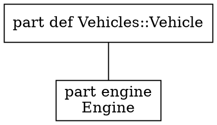

# View rendering forms — the view engine's writers

> **Labels.** This is an engineering record. "Track W" and its items (`W1`–`W3`) name entries of
> [the roadmap](roadmap.md), where each is stated in full; a reader who only wants the design can
> ignore them.

Status: **`text`, `markdown`, `mermaid` and `dot` implemented** — `dot` is Track W's `W1`, wired
into every surface `W3` names. `plantuml` (`W2`) is not written. This page records how a view's
rendering is separated from the forms it is written in, why Graphviz DOT is offered next to
Mermaid, and what the DOT writer does and does not yet emit.

## The rendering and its forms

A view renders into a `view.Rendering` (`internal/core/view/view.go`): the kind (`tree`,
`interconnection`, `state`, `action`, `sequence`, `table`), typed nodes with an identifier, a
kind, a name, an optional detail and their children, edges with a label and an `EdgeKind`
(connection, transition, succession, flow), a table's columns and rows, the origin of every node
and row, and notices for what the kind could not represent. The tree, interconnection, state and
action kinds are produced from the model — the last two from the lowered `StateGraph` and
`ActionGraph` the runtime executes — and nothing in the rendering is text of any diagram
language.

A **form** is a writer over that tree (`internal/core/view/form.go`):

| Form | Writer | Kinds | Role |
| --- | --- | --- | --- |
| `text` | `text.go` | every kind | What a person reads at a terminal |
| `markdown` | `markdown.go` | `table` | The machine-readable form of a table |
| `mermaid` | `mermaid.go` | `tree`, `interconnection`, `state`, `action`, `sequence` | The default machine-readable form of the graph-shaped kinds |
| `dot` | `dot.go` | `tree`, `interconnection`, `state`, `action` | Graphviz DOT, the alternative to Mermaid |

`Kind.MachineForm` chooses the form a tool gets when none is asked for — `markdown` for a table,
`mermaid` for everything else — and `Kind.SupportsForm` decides whether a kind can be written in
a form at all. Asking for a form the kind is not written in is one typed `WrongFormError`, naming
the kind, the form asked and the form the kind uses, on every surface: the CLI stops with status 2
(`-render-all` skips the view and says so), the REPL prints the usage, the LSP refuses the request,
and a document's `Diagram` block is refused at planning time.

## Why DOT next to Mermaid

Mermaid was chosen first because it draws where models are read — Markdown, documentation sites,
editors — with nothing installed. It stays the default. DOT is offered beside it for what Mermaid
is not:

- **Graphviz toolchains.** Publishing pipelines that already run `dot`, `neato` or `fdp` take DOT
  as input and produce SVG, PDF or PNG with a layout Mermaid's browser renderer cannot match on a
  graph of hundreds of nodes.
- **Exact positions.** DOT has a native vocabulary for a node's position (`pos`), size and an
  edge's route, which Mermaid lacks. The writer emits none of those yet, but the header line
  `// layout: dot` already states the engine the file is written for, so a writer that carries
  positions can switch it to `neato -n` without changing the file's shape.

Producing DOT needs **no Graphviz installation**. The writer is text over the rendering tree,
exactly as `mermaid.go` is, and nothing in the repository runs a Graphviz binary — not the writer,
not the tests, not the PDF backend.

## What the DOT writer emits



- **Header.** `// view: <name>` when a view was named, `// kind: <kind>`, `// stated: <how the
  kind was decided>` when the rendering records it, one `// not represented: <notice>` per
  notice — the same facts the Mermaid form writes as `%%` comments — and `// layout: dot`.
- **Graph.** `digraph "<view>"` (`digraph` alone for a pseudo-view), `graph [rankdir=<dir>]` when
  a direction is asked for and nothing when it is not, `node [shape=box]`, and `compound=true`
  only when an edge ends at a cluster.
- **Nodes.** A leaf is `"<id>" [label="<name>\n<detail>"]`, the detail line omitted when empty.
  In an interconnection, state or action rendering a node with children is
  `subgraph "cluster_<id>" { label="<name>"; … }`, the containment Mermaid writes as `subgraph`;
  in a tree, containment is an `arrowhead=none` edge, as the Mermaid tree draws it, so a tree has
  no clusters. Since DOT edges join nodes, not subgraphs, every cluster holds an invisible,
  sizeless anchor node named by the cluster's own ID; an edge whose end is a cluster names that
  anchor, so the rendering's endpoints survive verbatim, and is clipped at the cluster with
  `lhead`/`ltail` — except at an end that encloses the other, where the edge starts or ends
  inside it rather than at a border it never crosses.
- **State kind.** A state is a rounded box, a region a dashed cluster, the start pseudo-state a
  `point`, an initial state a `circle`, a final state a `doublecircle`; a transition's label is the
  trigger/guard/effect text the state writer composes, unchanged.
- **Edges.** The `EdgeKind` styles parallel the Mermaid arrows so the two forms read alike:

  | `EdgeKind` | Mermaid | DOT |
  | --- | --- | --- |
  | connection | `---` | `arrowhead=none` |
  | transition, succession | `-->` | solid, default arrowhead |
  | flow | `-.->` | `style=dashed` |

- **Quoting.** Every identifier and label passes through one helper that double-quotes it and
  escapes `"`, `\` and newlines; the writer never emits an unquoted identifier.
- **Order.** Nodes and edges are written in the rendering's order; nothing is emitted from a map.

Two functions, `dotNodeAttributes` and `dotEdgeAttributes`, produce a node's and an edge's
attribute list. They are the seam a later change writes a position, a size or a route through,
without touching how the graph is walked.

## Surfaces

`dot` is accepted wherever a form is chosen:

| Surface | Where | Documentation |
| --- | --- | --- |
| CLI | `-render <view> -render-form dot`; `-render-all <dir> -render-form dot` writes `.dot` files | [`docs/reference/cli.md`](../reference/cli.md#rendering-a-view) |
| REPL | `%render <view> dot`; `%help` names it | [`docs/reference/repl-commands.md`](../reference/repl-commands.md#rendering-a-view) |
| LSP | `"form": "dot"` on `opensysml/render` | [`docs/reference/lsp.md`](../reference/lsp.md) |
| Documents | `DocumentQueries::Diagram::form = "dot"`: a ` ```dot ` fence in Markdown, `<pre class="dot">` in HTML, the source under a notice in PDF | [`docs/manual/authoring.md`](../manual/authoring.md#diagrams), [`docs/manual/outputs.md`](../manual/outputs.md) |

The gRPC service (`api/proto/sysml.proto`, `internal/grpc`) has no view-render RPC and no
render-form field — `RenderDocument` alone, to Markdown — so the wire contract carries no form
and did not change. A view-render RPC added later would take the form as a string, as
`-render-form` does.

## Test contract

- `internal/core/view/dot_test.go`: a `*.dot.golden` beside every Mermaid golden for the tree,
  interconnection, state, state-entry, action and filtered fixtures, each walked by an in-test
  DOT syntax check — balanced braces, every edge endpoint declared as a node or a cluster,
  every identifier quoted — so a golden is proven well-formed without shelling out to `dot`;
  the wrong-form errors for `sequence` and `table`; quoting of names holding `"` and `\`;
  nested clusters and tree containment; every direction and the empty one; every `EdgeKind`;
  the state shapes and labels; the empty rendering and its notices.
- `cmd/sysml/render_test.go`, `internal/repl/view_render_test.go`, `internal/lsp/render_test.go`:
  the form on each surface, and its refusal for a table or sequence.
- `internal/core/docplan`, `docir`, `docrender`, `docpdf`: the `form` attribute planned,
  carried, written as a `dot` fence and a `<pre class="dot">`, and kept as source in the PDF
  without a diagram tool being looked for.

## Known limitations

- No node position, size or edge route is written; the rendering tree carries none yet.
- The PDF backend does not draw a DOT diagram. It keeps the source readable under a notice,
  and looks for no Graphviz tool.
- A `sequence` rendering has no DOT form. DOT has no sequence-diagram vocabulary; the Mermaid
  `sequenceDiagram` form remains the only machine-readable one.
- Node shapes are not yet specialised for action control nodes (fork, join, decision): those
  take the default box with their kind in the label.
