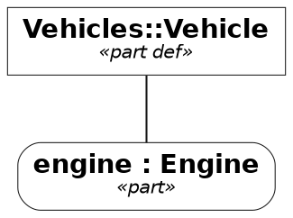
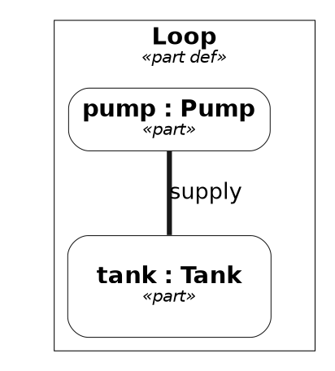

# View rendering forms — the view engine's writers

> **Labels.** This is an engineering record. "Track W" and its items (`W1`–`W3`) name entries of
> [the roadmap](roadmap.md), where each is stated in full; a reader who only wants the design can
> ignore them.

Status: **`text`, `markdown`, `mermaid`, `dot` and `plantuml` implemented** — `dot` is Track W's
`W1` and `plantuml` its `W2`, both wired into every surface `W3` names. This page records how a
view's rendering is separated from the forms it is written in, why Graphviz DOT and PlantUML are
offered next to Mermaid, and what the DOT and [PlantUML](#plantuml) writers emit — the
[DiagramLayout](diagram-layout-annotations.md) geometry included.

## The rendering and its forms

A view renders into a `view.Rendering` (`internal/ir/view/view.go`): the kind (`tree`,
`interconnection`, `state`, `action`, `sequence`, `table`), typed nodes with an identifier, a
kind, a name, the declared type of a typed usage, an optional detail holding the notes (`initial`,
`already shown`, `own flow`) and their children, edges with a label and an `EdgeKind`
(connection, binding, transition, succession, flow), a table's columns and rows, the origin of every node
and row, and notices for what the kind could not represent. The tree, interconnection, state and
action kinds are produced from the model — the last two from the lowered `StateGraph` and
`ActionGraph` the runtime executes — and nothing in the rendering is text of any diagram
language.

What a kind walks into nodes is model content. A view's own bookkeeping is left out of every
kind, by the one member walk the kinds share (`contentKind` in `tree.go`): a
[DiagramLayout](diagram-layout-annotations.md) annotation — a `Canvas`, `Layout` or `Route`,
whether a prefix `@Layout` or a `metadata Layout about …` member, wherever it is owned — and the
`render` members a view holds (`render asTreeDiagram;`, `render rendering r : AsTree;`). Both say
how a picture is drawn, not what the model is, so a tree over a package of migrated views draws
those views without the `metadata` and `render` nodes their annotations would add. The
`MigrationMetadata::SynthesizedName` marker a migration leaves in a body is left out the same way:
it records what the migration did, not what the model holds. Every other metadata usage — a
user's `metadata Approved about errorCBE { by = "review"; }`, an annotation typed by any
definition outside `DiagramLayout` and `MigrationMetadata` — is drawn as before, and a rendering
usage owned by anything but a view (a `rendering` under a package) stays a node.

A **form** is a writer over that tree (`internal/ir/view/form.go`):

| Form | Writer | Kinds | Role |
| --- | --- | --- | --- |
| `text` | `text.go` | every kind | What a person reads at a terminal |
| `markdown` | `markdown.go` | `table` | The machine-readable form of a table |
| `mermaid` | `mermaid.go` | `tree`, `interconnection`, `state`, `action`, `sequence` | The default machine-readable form of the graph-shaped kinds |
| `dot` | `dot.go` | `tree`, `interconnection`, `state`, `action` | Graphviz DOT, the alternative to Mermaid |
| `plantuml` | `plantuml.go` | `tree`, `interconnection`, `state`, `action`, `sequence` | PlantUML in the Pilot visualizer's B&W style, for PlantUML toolchains |

`Kind.MachineForm` chooses the form a tool gets when none is asked for — `markdown` for a table,
`mermaid` for everything else — and `Kind.SupportsForm` decides whether a kind can be written in
a form at all. Asking for a form the kind is not written in is one typed `WrongFormError`, naming
the kind, the form asked and the form the kind uses, on every surface: the CLI stops with status 2
(`-render-all` skips the view and says so), the REPL prints the usage, the LSP refuses the request,
and a document's `Diagram` block is refused at planning time.

## Node labels

Every graphical form draws a node's label the way the graphical notation heads a compartment:
the element's name first, the kind after it. `label.go` composes the lines once, and each writer
only joins them:

1. the name, with ` : Type` after it for a typed usage (`pump : Pump`); a definition has just its
   name; an anonymous element leads with its kind instead, or with ` : Type` alone when typed.
   A name the model did not give is not shown and the node heads as an anonymous one: a name a
   [v1 migration](../reference/sysml-v1-migration.md) made up for an element its source left
   unnamed, which it marks with `MigrationMetadata::SynthesizedName`, and the language's own
   `start` and `done` of an action's flow (`Node.NameSynthesized`, `shown` in `label.go`);
2. the kind in guillemets, `«part»`, `«state def»` — left out when line 1 is already the kind;
3. the detail, when there is one.

The name and type a node carries (`Node.Name`, `Node.Type`, the JSON's `name` and `type`) stay
as the walk spells them — a root's name qualified, a nested member's simple, a type as the
declaration references it — and the text form prints them so. The graphical forms head a node
the way a diagram frame does (`labeller` in `label.go`): the roots' names lose the namespace
every named root shares — the longest run of leading qualifier names common to all of them, so
`Plant::Loop` alone heads `Loop`, `Systems::Radio` beside `Systems::Braking::Brake` heads
`Radio` beside `Braking::Brake`, and roots from unrelated packages keep their whole names — and
a type is named by the name each of its references ends in, its `~` kept (`~Ports::FuelPort` is
`~FuelPort`; `Pump, ~FuelPort` for a pair); a name the roots' namespace does not head, and a type
that does not read as references, are shown whole. A member drawn under a drawn owner — a child
node, or a nested exposed element whose owner is a node of the same rendering — is headed by its
name below the nearest such owner, as a compartment or a nested box in a diagram frame shows it:
`'K-Mirror Offset'::'interpolation Error' : 'Interpolation Error'` under the `'K-Mirror Offset'`
node heads `'interpolation Error' : 'Interpolation Error'`, and a name with a single segment is
shown whole. Only the graphical heads change: `Node.Name`, the JSON and the text form keep the
qualified name. The DOT writer sizes a box from the same label it emits, so a box a Layout does
not size holds what it is headed with; a box a Layout sizes has its label fitted to it
([Geometry](#geometry)).

Mermaid joins the lines with `<br>` in every grammar it writes — a flowchart node label, a
`state "…" as n` and a `participant n as …` — which the pinned `mermaid-cli` breaks at whether
`htmlLabels` is on (the text becomes HTML, `<br>` a line break) or off (the label is split into
`<tspan>` rows); no `<br>` survives as text in the drawing. The tree, interconnection and action
kinds draw the same flowchart labels. A flowchart reserves one line of height for a `subgraph`
title and draws the first child over the rest, so a rendering whose cluster title spans several
lines opens on a YAML frontmatter block, `config: flowchart: subGraphTitleMargin: bottom: <n>`,
claiming 24px per extra line as the title's bottom margin (`writeFlowchartFrontmatter`); the
block rides the text into every consumer, and a flowchart without such a cluster, a tree, a
state diagram and a sequence diagram carry none. Every `subgraph` opens on a `direction`
statement restating the flowchart's own (`TD`, `LR` for an interconnection, or the one asked
for), since Mermaid lays out a subgraph that states none without regard to the flowchart's;
a tree draws containment as edges, not subgraphs, so it states none. DOT writes an HTML-like
label, `label=<<b>pump : Pump</b><br/><font point-size="10">«part»</font>>`, the name in bold
and the keyword line under the 14pt Graphviz draws the rest in; `&`, `<`, `>` and `"` in a name become entities so no name
reads as markup. A cluster's label is the same string. The text form keeps the notation's
declaration order, `part pump : Pump`, with a detail parenthesised after it. The declared type is
a field of the node (`Node.Type`, `type` in the JSON), never parsed back out of the detail.

## Edge labels

An edge is labelled by its own text when it has any, and by its name only when it has none
(`edgeLabel` in `behavior.go`): a transition's label is its trigger, guard and effect, `accept Sig
[g] / act`; a succession's its guard and probability, `[g] p = 0.5`; a flow's the pins or the
payload it carries, `out to in`, `of Water`; and a connection's the name, else the declared type,
else the keyword. A named edge with none of that — a completion transition, a plain succession, a
binding — is labelled by its name, `'off then on'`. The rule holds for every kind and every name,
whether the model's author gave it or the [v1 migration](../reference/sysml-v1-migration.md#edges-a-diagram-shows)
spelled it from the ends: a triggered transition named `idle_to_moving` reads `accept Signal
[temperature > 0]`, as the graphical notation draws it, since the name adds nothing a reader
looks for and a migrated name would only repeat the ends. A name the migration made up because
the source had none (`MigrationMetadata::SynthesizedName`) never becomes a label: an edge with no
text of its own and such a name is drawn unlabelled, as its source drew it. The rule is one place,
so the text, Mermaid, DOT and PlantUML forms label an edge alike.

A trigger names its signal or operation the way a node's type is named, by the name the reference
ends in (`triggerLabel` in `behavior.go`): `accept Signals::'APS Internal'::'Go Now'` reads
`accept 'Go Now'`, a named payload keeps its name (`accept msg : Halt`) and a call trigger its
arguments (`accept setSpeed(value)`, `accept halt()` — the parentheses tell a call from a signal), so a transition a v1 migration wrote with the signal's whole
path does not carry that path across the drawing. A time or change event, and an accept of an
event feature (`accept :> shutDown`), keep their written text.

## Why DOT next to Mermaid

Mermaid was chosen first because it draws where models are read — Markdown, documentation sites,
editors — with nothing installed. It stays the default. DOT is offered beside it for what Mermaid
is not:

- **Graphviz toolchains.** Publishing pipelines that already run `dot`, `neato` or `fdp` take DOT
  as input and produce SVG, PDF or PNG with a layout Mermaid's browser renderer cannot match on a
  graph of hundreds of nodes.
- **Exact positions.** DOT has a native vocabulary for a node's position (`pos`), size and an
  edge's route, which Mermaid lacks. The writer fills it from the rendering's DiagramLayout
  geometry (below), so a view laid out in an editor is drawn by Graphviz where the editor put
  it; the Mermaid form can only carry the same numbers as `%%` comments.

Producing DOT needs **no Graphviz installation**. The writer is text over the rendering tree,
exactly as `mermaid.go` is, and neither the writer nor its tests run a Graphviz binary. The one
place that does is the PDF backend, and only to draw the figure it embeds: `internal/doc/docpdf`
runs the `dot` that `OPENSYSML_DOT` names (else the one on `PATH`) with `-Tsvg`, under the engine
the block's `// layout:` header names, so a positioned view is drawn where its `Layout`s put
it. Without a Graphviz the PDF keeps the DOT source under a notice, as it does without any
optional tool — see [Surfaces](#surfaces).

## What the DOT writer emits



- **Header.** `// view: <name>` when a view was named, `// kind: <kind>`, `// stated: <how the
  kind was decided>` when the rendering records it, one `// not represented: <notice>` per
  notice — the same facts the Mermaid form writes as `%%` comments — and `// layout: dot`.
- **Graph.** `digraph "<view>"` (`digraph` alone for a pseudo-view), a `graph` statement with the
  font and `rankdir=<dir>` when a direction is asked for, the `node` and `edge` defaults of the
  [style](#style) below, and `compound=true` only when an edge ends at a cluster.
- **Nodes.** A leaf is `"<id>" [label=<<b><head></b><br/><font point-size="10"><i>«<kind>»</i></font><br/><detail>>]`,
  the [label lines above](#node-labels) as an HTML-like string, the detail line omitted when
  empty; a usage adds `style="rounded,filled"` before its label. In an interconnection, state or
  action rendering a node with children is
  `subgraph "cluster_<id>" { label=<…>; color=black; penwidth=<w>; … }`, the containment Mermaid writes as `subgraph`;
  in a tree, containment is an `arrowhead=none` edge, as the Mermaid tree draws it, so a tree has
  no clusters. Since DOT edges join nodes, not subgraphs, every cluster holds an invisible,
  sizeless anchor node named by the cluster's own ID; an edge whose end is a cluster names that
  anchor, so the rendering's endpoints survive verbatim, and is clipped at the cluster with
  `lhead`/`ltail` — except at an end that encloses the other, where the edge starts or ends
  inside it rather than at a border it never crosses.
- **State kind.** A state is a rounded box, a region a dashed cluster, the start pseudo-state a
  `point`, an initial state a `circle`, a final state a `doublecircle` — an unnamed initial or
  final one the filled black UML dot, a named one a labelled ring; a transition's label is the
  trigger/guard/effect text the state writer composes, unchanged.
- **Edges.** The `EdgeKind` styles parallel the Mermaid arrows so the two forms read alike:

  | `EdgeKind` | Mermaid | DOT |
  | --- | --- | --- |
  | connection | `---` | `arrowhead=none, penwidth=3` |
  | binding | `---` | `arrowhead=none` |
  | transition, succession | `-->` | solid, default arrowhead |
  | flow | `-.->` | `style=dashed` |

  An interconnection draws a `binding` between two features as an edge of its own kind, a plain
  undirected line beside the heavy connection (`==` in the text form, `--` in PlantUML), and
  pins its `DiagramLayout::Route` as it pins a connection's.

- **Quoting.** Every identifier, edge label and geometry value passes through one helper that
  double-quotes it and escapes `"`, `\` and newlines; a node or cluster label is an HTML-like
  string whose text passes through one helper that writes `&`, `<`, `>`, `"` and `'` as entities.
  The writer never emits an unquoted identifier or unescaped label text.
- **Order.** Nodes and edges are written in the rendering's order; nothing is emitted from a map.
  Within an attribute list, what a node *is* (shape, style, colours, label) precedes where it is
  (`pos`, `width`, `height`).

Three methods of the writer produce every attribute list — `graphAttributes`,
`dotNodeAttributes` (with `dotClusterAttributes` and `dotAnchorAttributes` for a node drawn as a
cluster) and `dotEdgeAttributes` — so what is said about a node or an edge changes without
touching how the graph is walked.

## Style

The DOT form is drawn in the **Standard B&W style** of the OMG SysML v2 Pilot Implementation's
PlantUML visualizer, after the `sysmlbw` PlantUML skin by Hisashi Miyashita (Mgnite Inc.) shipped
with it — `github.com/himi/plantuml`, branch `psysml`,
`bundles/net.sourceforge.plantuml.lib/skin/sysmlbw.skin` — and the edge rules of the Pilot's
`org.omg.sysml.plantuml/src/org/omg/sysml/plantuml/SysML2PlantUMLStyle.java`. The Pilot source is
EPL-2.0 (its file header). The skin file carries no licence header of its own; the bundle it ships
in, `net.sourceforge.plantuml.lib`, is under the Eclipse Public License v1.0 (its `COPYING`), the
licence the fork's README names for the whole repository. This project reproduces the skin's visual
parameters (colours, line widths, font choices) in Graphviz's and PlantUML's vocabularies, not its
text. The Pilot's default is `skin sysmlbw`, `skinparam monochrome true` and `hide circle`; the
translation to DOT is:

| Skin / Pilot rule | DOT |
| --- | --- |
| `FontName SansSerif`, `FontSize 14`, `FontColor black` | `graph`, `node` and `edge` default `fontname="Helvetica"`, Graphviz's portable sans-serif; `fontsize=14` on nodes; text stays black |
| `BackGroundColor #ffffff`, `monochrome true` | node default `style=filled, fillcolor=white`; no other colour without a [palette](#palettes) |
| `LineColor #181818`, `element { LineThickness 0.5 }` | node default `color="#181818", penwidth=0.5` |
| `RoundCorner 0` for definitions, `UsageRoundCorner 20` for usages | a definition (`… def`, or a KerML classifier keyword) keeps `shape=box`; a usage adds `style="rounded,filled"`. Graphviz's corner radius is fixed, so the 20-unit radius is approximated |
| `stereotype { FontStyle italic }` | the `«keyword»` label line is `<i>…</i>` at its 10 pt size |
| `element { title { FontStyle bold } }` | the name line is `<b>…</b>` |
| `stateDiagram { element { title { FontStyle plain } } }` | not followed: a state's name stays bold, as in every other kind and in the text and Mermaid forms, so the four forms read alike |
| `group { BackGroundColor transparent; LineThickness 1.0 }`, `package { LineThickness 1.5; LineColor black }`, `stateDiagram { group { LineThickness 0.5 } }` | a cluster is unfilled with `color=black`; `penwidth=1.5` when its kind is a package, `penwidth=0.5` for a cluster standing for an element and for a region (which keeps `style=dashed`) |
| `arrow { FontSize 13; LineThickness 1.0 }` | edge default `color="#181818", fontsize=13, penwidth=1` |
| Pilot `caseConnectionUsage`, `caseConnector`: `-[thickness=3]-` | `EdgeConnection`: `arrowhead=none, penwidth=3` |
| Pilot `caseFlow`, `caseSuccession`, `caseTransitionUsage`: `-->` | the `EdgeKind` table above, unchanged |
| initial and final pseudo-states | the UML filled black dot: `shape=circle` (`doublecircle` for a final), `fillcolor=black`, `label=""`, `width=0.2` unless a Layout sizes it; a pseudo-state the model names keeps its labelled ring unless a Layout sizes it. An action's `start` and `done`, being the language's names and not the body's, and a name a migration made up (`Node.NameSynthesized`) are the dot and the ring, as the notation draws them. The `start` point is unchanged |
| symbol kinds in a stated box | a node whose Layout states a size and whose kind has a notation symbol is drawn as the symbol with no text inside it: `decision`, `merge` and `choice` as `shape=diamond`; `fork` and `join` as the filled bar (the stated box, `fillcolor=black`); `initial` and `junction` as the filled dot; `final` and a terminate action as `shape=doublecircle, fillcolor=black`; a port (`port`, `ref port`, not a `port def`) as its stated square, filled by the palette when one is set. The head the node would have carried is set beside the symbol as `xlabel="…"`, a plain string, and left out when `Node.NameSynthesized` marks the name as one a migration made up |

Not translated, because Graphviz has no vocabulary for them: `Shadowing 0` (no shadows to turn
off), `hide circle` (no class circles), `wrapWidth 300` (DOT does not wrap label text; the writer
wraps only a head it fits to a stated box), and the 20-unit corner radius. Out of scope: the skin's notes, sequence, gantt, mindmap and wbs
sections — the DOT form draws no notes and a sequence rendering has no DOT form. The Pilot's
`-[thickness=5]-` binding connectors are `EdgeBinding`, drawn as a plain undirected line: thinner
than a connection, not heavier, so a binding reads as the equation it is rather than a channel.

### Palettes

A `view.Palette` fills the DOT and PlantUML forms' nodes by **keyword family**, the way the Pilot's
`STDCOLOR` mode does, so a `part def` and a `part` share a hue. The empty palette is the B&W
default above. Every named palette is colourblind-safe:

| Name | Source | Colours |
| --- | --- | --- |
| `okabe-ito` | Okabe & Ito, *Color Universal Design* (2002, jfly.uni-koeln.de/color) | `#E69F00 #56B4E9 #009E73 #F0E442 #0072B2 #D55E00 #CC79A7 #999999` |
| `tol-bright` | Paul Tol, *Colour Schemes*, SRON technical note 3.2 (2021), personal.sron.nl/~pault | `#4477AA #EE6677 #228833 #CCBB44 #66CCEE #AA3377 #BBBBBB` |
| `tol-muted` | same note | `#332288 #88CCEE #44AA99 #117733 #999933 #DDCC77 #CC6677 #882255 #AA4499 #DDDDDD` |
| `tol-light` | same note | `#77AADD #99DDFF #44BB99 #BBCC33 #AAAA00 #EEDD88 #EE8866 #FFAABB #DDDDDD` |
| `brewer-set2` | ColorBrewer 2.0 Set2, Cynthia Brewer (colorbrewer2.org) | `#66C2A5 #FC8D62 #8DA0CB #E78AC3 #A6D854 #FFD92F #E5C494 #B3B3B3` |
| `brewer-dark2` | ColorBrewer 2.0 Dark2 | `#1B9E77 #D95F02 #7570B3 #E7298A #66A61E #E6AB02 #A6761D #666666` |
| `viridis` | matplotlib's viridis (van der Walt & Smith; CC0), 16 evenly spaced stops | `#440154 … #FDE725` |
| `cividis` | matplotlib's cividis (Nuñez, Anderton & Renslow 2018; CC0), 16 stops | `#00224E … #FEE838` |

ColorBrewer notice: Set2 and Dark2 are colour specifications and designs developed by Cynthia
Brewer (http://colorbrewer.org/), licensed under the Apache License, Version 2.0.

- **Families**, in fixed order: part, item, port, attribute, action, state, requirement,
  constraint, connection, interface, use case, case, allocation, analysis, verification, enum,
  occurrence, flow, then anything else. A kind is placed by the first of its words with a family
  (`perform action` is an action, `analysis case` an analysis), the `def` suffix set aside. The
  family's place in this order is its index into a qualitative palette, so a diagram with only
  parts and ports uses the palette's first and third colours whatever else is absent; a palette
  shorter than the families wraps round. A sequential palette (`viridis`, `cividis`) is instead
  sampled evenly across the families present in the rendering, darkest first.
- **Definitions and usages.** A definition takes the family colour as `fillcolor`; a usage a tint
  of it, blended 60 % toward white. Both borders are the untinted family colour at `penwidth=1`.
  The PlantUML form writes the same fill as `#hex` on the element declaration, with the border as
  `;line:hex`, so the two forms agree on every node's hex (`TestPlantUMLPaletteParityWithDOT`); a
  sequence participant takes the fill alone, PlantUML accepting no border colour on one.
- **Contrast.** Text stays black. Every fill — definition or usage — is lightened toward white,
  a hundredth at a time, until black text on it reaches the WCAG 2 level-AA ratio of 4.5:1; a
  colour already legible is unchanged. One function (`paletteFill`) defines the blend, and a test
  asserts the ratio for every colour of every palette at both tints.
- **What stays black and white.** Pseudo-states, control nodes (fork, join, decision, …) and
  cluster borders keep the B&W rules under every palette; only plain nodes are filled.
- **Other forms.** Mermaid writes a `%% not represented: palette <name>; only the DOT and PlantUML
  forms fill nodes by keyword family` comment and is not themed; text and Markdown ignore a
  palette silently. An unknown palette name is a typed `*view.UnknownPaletteError` (wrapping
  `view.ErrUnknownPalette`) naming the palettes there are, on every surface.

The palette API is shaped so a later caller can ask for the colour of category *i* of *n*
(`Palette.Color(i, n)`) without knowing about keyword families; colouring by a data attribute or
query result is not built.

## Geometry

A rendering carries the [DiagramLayout](diagram-layout-annotations.md) annotations of its view — a
`Rendering.Canvas`, a `Node.Geometry`, an `Edge.Route` — in the library's units: pixels,
y down, origin at the canvas's top-left corner. Graphviz reads points, y up, from the
bottom-left; the writer converts, so the DOT it writes is laid out by Graphviz without a
preprocessing step:



- **Scale.** One pixel is one point: `inputscale=72` tells `neato` that `pos` is in points, and
  `dpi=72` keeps the rendered pixel at that size. Lengths Graphviz takes in inches — a node's
  `width`/`height` — are divided by 72.
- **Axis.** `y` is flipped: measured up from the canvas's bottom edge (`height - y`) when the
  canvas states a height, negated when it does not. `x` is unchanged.
- **Canvas.** A `Canvas` is echoed in the header as `// canvas: unit=<u> w=<w> h=<h>` (the
  parts it states). When it has an extent and a node is positioned, an invisible, sizeless
  point is pinned at each of its corners — `"canvas:0"` at the origin, `"canvas:1"` at
  `(w, h)` — so the drawing's bounding box is the canvas, not the hull of the nodes: Graphviz
  recomputes the root `bb` and ignores a `size` larger than the drawing, but it keeps a pinned
  node where it is. The names cannot collide with a rendering's `n<i>` node IDs.
- **Nodes.** A `Layout` names the box's top-left corner; Graphviz positions a node's centre, so
  the writer pins `pos="x,y!"` at the centre of the box and `pin=true` keeps `neato` from
  moving it. A stated size is `width`/`height` in inches with `fixedsize=true`, and the label
  is composed to fit it (`dotFittedLabel` in `dot.go`), never the box grown to the label: the
  node's `margin=0` gives the whole box to the label (Graphviz's default pads it by 0.11 by
  0.055 in, which a 14 px compartment row cannot spare), the head is word-wrapped at the box's
  width and drawn at the largest whole font size from 14 pt down to 8 pt at which the wrapped
  lines stack within the height with every word whole — a word wider than the box at every size
  is broken where it overruns, at the largest size whose lines then fit; the keyword line (at
  10/14 of the head's size) and each detail line follow only while height remains for them, so
  a 449×14 px compartment row holds
  `<font point-size="11"><b>errorReq : Real</b></font>` and nothing else; a head that overruns the
  height even at 8 pt is cut to the lines that fit and its last line ellipsized. A stated box
  that holds other stated boxes — a part whose members are drawn inside it, a definition over
  its compartment rows — keeps its title clear of them: the label is fitted to the strip between
  the box's top and the topmost box it encloses and set there with `labelloc=t`, so the title
  reads as a diagram frame's header and the members below it stay where the Layout put them
  (`headroom` in `dot.go`; a box that is only placed, and so sized to its own label, is not one
  the title moves for). A stated box too short for one 8 pt line, or too narrow for one glyph —
  whether the whole box or the strip its members leave it — holds no text: its head is set
  outside as `xlabel`, as a symbol's is, and a box with only its kind to show is left bare
  (`dotStatedLabel`). A stated node drawn as a cluster round its children has its label fitted the
  same way, to the strip above its topmost stated child; a cluster's label has no outside to go
  to, so a strip thinner than a line still gets one line at 8 pt. The estimate is
  the box fitting's own — 0.6 em a glyph (0.66 em bold), 1.2 em a line — so nothing here is
  particular to the tool that stated the box. A symbol kind in a stated box carries no label at
  all ([Style](#style)). Without a stated size
  the writer sizes the box to the label itself — 0.6 em a glyph (0.66 em in the bold head),
  1.2 em a line, at 14 pt for every line but the 10 pt keyword line, Graphviz's margins, no
  smaller than its 54×36 pt default box, a circle round the label for a
  pseudo-state, a 3.6 pt point for a start — and writes that `width`/`height` without
  `fixedsize`, so Graphviz may still grow the box for its own font but the corner is where the
  Layout put it under the writer's estimate. `collapsed` is kept as `comment="collapsed"`, an
  attribute Graphviz ignores and a consumer can read. A node with no `Layout` whose edge
  carries a `Route` of two or more waypoints is positioned by that route: the route's first
  waypoint is where it leaves the edge's source and its last where it reaches the target, so the
  node's box, sized as above, is centred one reach back from that waypoint along the route's end
  segment (the edge meets the border); several routes place it at the mean of the centres they
  give. A stated `Layout` always wins over a route, a route of one waypoint places nothing, and
  a node with neither `Layout` nor route is unpositioned. The `start` node and an initial or
  final node of a state rendering take their positions this way too, so a migrated diagram that
  drew them as pseudo-states but named no member for them is still positioned throughout.
- **Clusters.** A node drawn as a cluster writes its box as `bb="llx,lly,urx,ury"` and pins
  its anchor node at the box's centre. The box is the stated one, or, with a corner alone, the
  one from that corner round its positioned members' boxes with Graphviz's 8 pt cluster margin;
  a cluster with no `Layout` takes the box round its positioned members alone, and one with
  a corner and no positioned member has no box to state and pins its anchor at the corner.
- **Edges.** A `Route` becomes `pos` as the cubic B-spline Graphviz reads: each segment's ends
  are its own control points, so the spline is the polyline through the waypoints. A route of
  one waypoint draws no line; it is left out and noticed as `// not represented:`. Every edge a
  kind draws takes a route: a connection, binding or flow of an interconnection, a transition
  of a state rendering, a succession or flow of an action rendering — the annotation names the
  member (`metadata DiagramLayout::Route about 'a to b'`), so only a named edge can carry one.
- **Unplaced nodes.** A node counts as positioned however its box was found — by its
  `Layout`, round its members, or from a route. When some nodes are positioned and others are
  not, the drawing shows what its source showed: the unpositioned nodes are left undrawn, with
  every edge at one of them and the containment edge a tree would draw to it, and a
  `// not represented:` notice counts them (`2 node(s) without a position, left undrawn, and 1
  edge(s) at them`), so nothing lands on a placed box — a migrated diagram's members the source
  diagram never drew stay out of its picture. `Options.Unplaced = UnplacedStrip`
  (`-render-unplaced strip` at the CLI, for `-render`, `-render-all` and the `dot` diagrams of a
  document) keeps them instead: each unplaced node not under another unplaced node (every one, in
  a tree) is boxed as an unpositioned node is — fitted to its label, or as a cluster round its
  children — and the boxes are packed in rows, left to right, wrapped at the drawing's width,
  24 px apart and 24 px below the drawing's extent (the canvas when it has one, else the
  positioned boxes and routes), then pinned like any other; the notice says so. A strip node
  keeps its place in the text — a member of a positioned cluster is written in that cluster,
  whose stated box is not stretched to it — so Graphviz draws it below the box it belongs to.
  A drawing with no positioned node is unchanged by either setting. An `Unplaced` that is
  neither is refused (`UnknownUnplacedError`). The classification is one `placement`
  (`placement.go`) every graph-shaped form draws by: the Mermaid and PlantUML forms of a partly
  positioned rendering draw the placed nodes and the edges between them, an omitted tree node's
  placed members detached from the node above as DOT draws them, under a `%% not represented:` or
  `' not represented:` notice with DOT's wording; under `UnplacedStrip` they draw every node,
  laid out by the tool that draws them, and say so. So the three forms draw one node set and one
  edge set of a positioned view, and a view exposing a package its layout does not place does not
  become a chart of the package's whole contents in Mermaid.
- **Engine.** The `// layout:` header names the command that honours what is written:
  `neato -n2` when any edge is routed (the pinned nodes and the written routes are taken as
  given, the other edges are drawn), `neato -n` when no edge is routed, `dot` when no node is
  positioned. Every node a positioned drawing draws is pinned, so plain `neato` is never named
  and `neato -n2`, which refuses a node with no position, always has one for each; a route of
  two or more waypoints positions its ends, so a written route is always read by `neato -n2`.
  A rendering with no geometry is written byte for byte as before.

The writer is still text over the tree: no Graphviz binary is run to produce, check or test
the output.

## PlantUML

The `plantuml` form is for toolchains that draw with PlantUML — the OMG Pilot's own visualizer
among them — and for the one graph-shaped kind DOT has no grammar for, the sequence. It is
produced by pure text emission over the rendering tree, as the other forms are: **no Java and no
PlantUML jar** is needed to write it, and neither the writer, its tests nor the CLI, REPL and LSP
surfaces run one. A jar, when present on a developer's machine, checks the goldens by hand
(`java -jar plantuml.jar -checkonly`) or draws them; it is not a dependency of the writer. The PDF
backend alone runs it, to draw the figure it embeds: `internal/doc/docpdf` pipes each block through
`java -jar $OPENSYSML_PLANTUML_JAR -tsvg -pipe`, the `java` from `OPENSYSML_JAVA` or `PATH`, and
keeps the source under a notice when either is absent — see [Surfaces](#surfaces).

```plantuml
@startuml
' VehicleViews::vehicleView — tree rendering
<style>
…
</style>
skinparam wrapWidth 300
hide stereotype
hide circle
hide empty members
class "**Vehicles::Vehicle**\n<size:10>//«part def»//</size>" as n0 <<part def>>
class "**engine : Engine**\n<size:10>//«part»//</size>" as n1 <<part>> <<usage>>
n0 -- n1
@enduml
```

Every file has the same shape, in this order:

1. `@startuml`.
2. The header comment, `' <view> — <kind> rendering (<stated>)` (`'` opens a PlantUML line
   comment), then one `' not represented: <notice>` line per notice of the rendering and per loss
   the writer itself incurs: a reversed direction, and geometry kept as comments.
3. The [style block](#the-inline-style) and `skinparam wrapWidth 300`, then `hide stereotype`.
4. The direction statement, when one applies: `top to bottom direction` for `TB`, `left to right
   direction` for `LR`. PlantUML draws no reversed direction, so `BT` and `RL` write the nearest
   forward one and a `' not represented: direction RL; …` notice records the loss. The empty
   direction leaves PlantUML's default. State and action diagrams take the same statements; a
   sequence ignores direction, as Mermaid does.
5. The [geometry](#geometry) as comments — `' canvas: unit=px w=800 h=600`, `' layout: <id> x=..
   y=.. w=.. h=.. collapsed`, `' route: <from>-><to> x,y x,y …` — the very lines the Mermaid form
   writes as `%%` comments, produced by the same `writeGeometryComments` with the comment prefix
   as a parameter. PlantUML has no absolute positioning, so a `Layout` or `Route` is carried, not
   honoured; a notice counts what was kept. **For pinned positions use the `dot` form.**
6. The diagram body, per kind (below).
7. `@enduml`.

**Aliases and labels.** Every node is declared as `<grammar> "<label>" as <id> <<stereotypes>>`.
The rendering's node IDs are `n<i>` (and `empty` for an empty rendering), already word characters,
so they are the PlantUML aliases unchanged and the mapping is the identity. The label is the
[name-first lines](#node-labels) of `label.go`, joined with `\n` inside one double-quoted string:
the name line in creole bold (`**…**`), the keyword line italic at 10 pt
(`<size:10>//«part»//</size>`), the detail line plain. One helper, `plantumlText`, writes every
label and edge label so PlantUML shows it as it is: `"`, `\`, `<`, `>` and the creole escape `~`
become `<U+XXXX>` escapes, as does each character of a run creole would read as markup (`**`,
`//`, `__`, `--`, `[[`, `]]`), and a newline becomes `\n`. The bare guillemets `«` `»` render as
themselves in the released jar and are written bare.

**Stereotypes.** Each node carries its keyword as a stereotype, `<<part def>>`, `<<state>>`,
`<<port>>`, so a style rule can select it, plus one shape stereotype the style block keys on:
`<<usage>>` on every usage (rounded corners) and `<<package>>` on a package (heavier border); a
definition and an orthogonal region carry no shape stereotype and keep the element rules. PlantUML
would print every stereotype as its own `«…»` line above the name, which would put the keyword
line twice on the node and the shape stereotype beside it, so the file says `hide stereotype`:
**the label prints the guillemet line, PlantUML does not** — one keyword line, name first, as in
the Mermaid and DOT forms. The stereotypes still drive the style and the pseudostate shapes. A
control node's stereotype stands alone (`<<start>>`, `<<fork>>`, …), since PlantUML draws the
pseudostate shape only when nothing else is attached.

**Per kind:**

- **`tree`** — a class diagram: `hide circle` and `hide empty members` as the Pilot's style does,
  one `class "…" as n<i> <<kind>>` per node and containment as an undirected edge `parent --
  child` from each node to each of its children, written right after the child. This is how the
  Mermaid and DOT trees draw containment — a tree of edges, no nested containers — so the three
  forms show the same picture and a tree has no blocks. The Pilot's `comp def`/`comp usage`
  element kinds exist only in the PlantUML fork and are not emitted; every element is a standard
  `class`.
- **`interconnection`** — nested `rectangle` blocks: a node with children is `rectangle "…" as
  n<i> <<kind>> {` … `}`, indented two spaces a level, a leaf a one-line `rectangle`. A port is a
  nested rectangle inside its owner, not a `portin`/`portout`: the released jar's port grammar
  belongs to `component` elements, and one grammar for every node keeps the style rules uniform.
  A connection is the Pilot's heavy undirected connector `a -[thickness=3]- b : label`, a flow a
  dashed arrow `a -[dashed]-> b : label`.
- **`state`** — the state grammar with `hide empty description`: `state "…" as n<i> <<state>>`,
  a body or composite state as `state … {` … `}` holding its substates, the body's start as the
  `[*]` marker inside its block (`[*] --> n1`, one per start edge, after the substates — the
  Mermaid writer's `starts` map, reused), and every other edge a transition `a --> b : label`
  with the trigger/guard/effect text the state writer composes. The rendering's control kinds
  map to PlantUML's pseudostate stereotypes: `initial` → `<<start>>`, `final` → `<<end>>`,
  `fork`/`join` → `<<fork>>`/`<<join>>`, `decision`, `choice`, `merge` and `junction` →
  `<<choice>>` (PlantUML has no round junction), `shallow history`/`deep history` →
  `<<history>>`/`<<history*>>`. Only the nodes the rendering holds are written; the start
  pseudostate is the `[*]` marker and no other node is invented. Regions carry `<<region>>`, which
  the style dashes.
- **`action`** — **the state grammar, uniformly.** PlantUML's activity grammar is procedural
  (`start`, `:action;`, `fork`, `if … then … endif`): it draws a program, not a graph, and cannot
  hold an arbitrary set of action nodes joined by successions and flows — a node with two
  incoming successions, a flow crossing a fork, a nested body with its own start — without
  inventing structure the rendering does not have. Rather than write activity syntax where the
  graph happens to be linear and fall back elsewhere, which would give two grammars for one kind,
  every action rendering is a state diagram: actions are states, control nodes the pseudostates
  above, a nested body a composite state with its `[*]` start, a succession a solid `-->`, a flow
  a dashed `-[dashed]->` labelled as the DOT writer labels it. Every node and edge of every action
  golden is drawn, nesting included.
- **`sequence`** — `participant "…" as n<i> <<kind>>` per root in root order, then `a -> b :
  label` per edge in edge order, `a -> b` for an edge without a label — the same participants and
  messages `mermaid.go`'s `writeSequenceDiagram` writes. An empty rendering writes one participant
  carrying `EmptyReason()`. Under a palette a participant is filled like any usage by keyword
  family (fill only; PlantUML takes no border colour on a participant), so the palette is
  represented, not noticed.

Hyperlinks are not written: no writer derives a stable URL from `Origin` today, and the PlantUML
form adds none on its own; `[[url]]` links stay open with the DOT `URL=` attribute.

### The inline style

PlantUML proper does not ship the `sysmlbw` skin — it lives in the fork alone — so every file
carries the B&W rules itself, in a `<style>` block (PlantUML's CSS-like style language) with the
one `skinparam` the block cannot express. The translation of the same two sources the
[DOT style](#style) credits:

| Skin / Pilot rule | PlantUML |
| --- | --- |
| `FontName SansSerif`, `FontSize 14`, `FontColor black`, `HorizontalAlignment left`, `BackGroundColor #ffffff` | `root { BackGroundColor white; FontName SansSerif; FontSize 14; FontColor black; LineColor #181818; HorizontalAlignment left }` |
| `LineColor #181818`, `element { LineThickness 0.5 }`, `Shadowing 0.0` | `element { BackGroundColor white; LineColor #181818; LineThickness 0.5; RoundCorner 0; Shadowing 0.0 }` — shadows are turned off, which DOT could not |
| `RoundCorner 0` for definitions, `UsageRoundCorner 20` for usages | `RoundCorner 0` on every element; `.usage { RoundCorner 20 }` on the `<<usage>>` shape stereotype, the skin's radius exactly — the fork's `UsageRoundCorner` property does not exist in released PlantUML, so the stereotype rule stands in for it |
| `stereotype { FontStyle italic }`, `element { title { FontStyle bold } }` | carried by the label, since the stereotype is hidden: the keyword line `//…//` at 10 pt, the name line `**…**` |
| `stateDiagram { element { title { FontStyle plain } } }` | not followed, as in DOT: a state's name stays bold so the forms read alike |
| `group { LineThickness 1.0 }`, `package { LineThickness 1.5 }`, `stateDiagram { group { LineThickness 0.5 } }` | `.package { LineThickness 1.5 }` on the `<<package>>` shape stereotype; every other block keeps the element's 0.5; `.region { LineStyle 4 }` dashes an orthogonal region as DOT does |
| `arrow { FontSize 13; LineThickness 1.0 }` | `arrow { LineColor #181818; LineThickness 1; FontSize 13 }` |
| note `BackGroundColor #FEFFDD`, 13 pt | `note { BackGroundColor #FEFFDD; FontSize 13 }` — no note is drawn today, the rule is there for one |
| Pilot `skinparam wrapWidth 300` | `skinparam wrapWidth 300`, the one rule written as a `skinparam`; DOT could not wrap |
| Pilot `hide circle` | `hide circle` on the class diagram (a tree), where the circle exists |
| Pilot `-[thickness=3]-` connectors, `-->` flows and successions | `-[thickness=3]-` for `EdgeConnection`; `-->` for a transition or succession; `-[dashed]->` for a flow, as the Pilot's `VAction` dashes flows |
| initial and final pseudo-states | PlantUML's own `<<start>>`/`<<end>>` dots, filled black by `start, end, activityBar { BackGroundColor black }` (the `element` rule would otherwise leave them and the fork/join bars hollow) |

So the three rules DOT could not honour — the 20-unit usage radius, shadows off and the 300 px
wrap — PlantUML honours in full; what PlantUML cannot honour and DOT does are absolute
positions and routes, kept as comments. `skinparam monochrome true` is not written: the rules
above already draw black and white, and monochrome would grey a palette's fills. Bindings draw at
connector weight, as in DOT, the rendering having no `EdgeBinding` kind.

A palette fills a node as `#hex;line:hex` after its stereotypes — one mechanism, the element
declaration, which the released jar honours on `class`, `rectangle`, `state` and `participant`
alike — with the [palette rules](#palettes) shared with DOT unchanged: same family, same tint, same
contrast lightening, same hex per node. Pseudostates, control nodes and containers stay B&W under
every palette, and text stays black.

## Surfaces

`dot` and `plantuml` are accepted wherever a form is chosen:

| Surface | Where | Documentation |
| --- | --- | --- |
| CLI | `-render <view> -render-form dot\|plantuml`; `-render-all <dir> -render-form dot` writes `.dot` files and `-render-form plantuml` writes `.puml` files; `-render-palette <name>` fills either | [`docs/reference/cli.md`](../reference/cli.md#rendering-a-view) |
| REPL | `%render <view> dot\|plantuml [palette]`; `%help` names them; the form and, after a form that takes one, the palette complete | [`docs/reference/repl-commands.md`](../reference/repl-commands.md#rendering-a-view) |
| LSP | `"form": "dot"` or `"plantuml"` and `"palette": "<name>"` on `opensysml/render`; a palette also gives each node of the result its `fill` and `border`, so a client drawing its own SVG colours a node as these forms do (`Rendering.Fills`) | [`docs/reference/lsp.md`](../reference/lsp.md) |
| VS Code | `SysML: Export Diagram` picks among the forms the server lists under its `openSysmlRenderForms` capability (the documented five for a server without it), sends the pick as `form`, and saves `.dot` or `.puml` (`.mmd`, `.md`, `.txt` for the others) | [`docs/guide/08-editors.md`](../guide/08-editors.md#exporting-a-diagram) |
| VS Code | The diagram panel's **Style** list and `opensysml.diagram.style`: `pilot` draws the panel's SVG under this section's B&W rules, a palette name fills its nodes from the `fill` and `border` the server returns | [`editors/vscode/README.md`](../../editors/vscode/README.md#the-diagram-panel) |
| Documents | `-render-document`/`-render-documents … -diagram-form dot\|plantuml`, `%render-document <name> dot\|plantuml`, `"diagramForm"` on `opensysml/renderDocument`: every graph-shaped diagram block as a ` ```dot ` or ` ```plantuml ` fence in Markdown, `<pre class="dot">` or `<pre class="plantuml">` in HTML; in PDF, a figure drawn by Graphviz (`OPENSYSML_DOT`, else `dot` on `PATH`; `-Tsvg` under the engine the `// layout:` header names) or by the PlantUML jar (`OPENSYSML_PLANTUML_JAR`, run by `OPENSYSML_JAVA` or the `java` on `PATH`, `-tsvg -pipe`), and the source under a notice naming the variable to set when the tool is absent; a tool that fails is the typed `tool-failed` error with its stderr, as `mmdc` is. The form is chosen at render time, not stated in the model: a `Diagram` block says what is drawn, not the notation — though it may state a `palette`, as it states a `direction`, which the DOT or PlantUML figure is filled with and the HTML figure carries as `data-palette` | [`docs/manual/authoring.md`](../manual/authoring.md#diagrams), [`docs/manual/outputs.md`](../manual/outputs.md), [`docs/reference/environment.md`](../reference/environment.md) |

The gRPC service (`api/proto/sysml.proto`, `internal/frontend/grpc`) has no view-render RPC and no
render-form field — `RenderDocument` alone, to Markdown — so the wire contract carries no form
and did not change. A view-render RPC added later would take the form as a string, as
`-render-form` does.

## Test contract

- `internal/ir/view/dot_test.go`: a `*.dot.golden` beside every Mermaid golden for the tree,
  interconnection, state, state-entry, action and filtered fixtures, each walked by an in-test
  DOT syntax check — balanced braces, every edge endpoint declared as a node or a cluster,
  every identifier quoted — so a golden is proven well-formed without shelling out to `dot`;
  the wrong-form errors for `sequence` and `table`; quoting of names holding `"` and `\`;
  nested clusters and tree containment; every direction and the empty one; every `EdgeKind`;
  the state shapes and labels; the empty rendering and its notices. The geometry has
  `layout.dot.golden` beside the Mermaid and text goldens of the same fixture, the flipped axis
  with and without a canvas height, the centring and label-fitted size of unsized nodes, sized
  and pseudo-state nodes, the `bb` and pinned anchor of a stated, a member-fitted and a
  corner-only cluster, a route's spline and the one-waypoint notice, the zero-extent canvas,
  and the header's engine for none, some and all of the nodes positioned and all edges routed;
  the syntax check parses every `pos` and `bb` it meets, and reads an HTML-like label as one
  string whose tags balance and whose entities are known.
- `internal/ir/view/dot_fit_test.go`: the label fitted to a stated box — a head wrapped at the
  width, kept at 14 pt while it fits and shrunk to 8 pt when it does not, the keyword and detail
  lines kept only while height remains, a compartment row's one line, a word broken across
  lines only when no size keeps it whole, the ellipsis at the floor, the title of a box that
  holds stated boxes fitted to the strip above them and set at the top, an only-placed box
  leaving it be, a stated cluster's label fitted to its strip, a box or strip too short or
  narrow for a line setting its head outside — and `dotFitHead`/`dotWrap`
  on their own; the symbol every kind draws as in a stated box, its `xlabel` for a name and none
  for a synthesized one, a `port def` and an unsized symbol kind still labelled; an unsized
  node's label unchanged.
- `internal/ir/view/label_test.go`: a member headed by its name below its drawn owner, at every
  depth and for a nested exposed element, an unrelated root left whole, the text form unchanged.
- `internal/ir/view/bookkeeping_test.go`: a tree over migrated views carries none of their
  `DiagramLayout` annotations, `SynthesizedName` markers or `render` members, while a user's
  metadata usage and a rendering usage outside a view are still drawn.
- `internal/ir/view/dot_style_test.go`, `palette_test.go`: the B&W defaults; a definition
  square and a usage rounded; the pseudo-state rules named and unnamed, placed and not; the
  package, element and region cluster widths; the connection's `penwidth=3`; the family of every
  kind and the stability of the family order; the contrast ratio of every palette colour at both
  tints; the sequential sampling; the unknown-palette error text; the Mermaid notice and the
  silence of the text and Markdown forms; labels holding `&`, `<`, `>`, `"`, `'` and newlines;
  and the `interconnection.okabe-ito`, `state.okabe-ito` and `tree.viridis` goldens.
- `internal/ir/view/plantuml_test.go`: a `*.plantuml.golden` beside every Mermaid golden — the
  tree, interconnection, state, state-entry, action, typed-action, typed-state, filtered, layout
  and every `sequence-*` fixture — and `interconnection.okabe-ito.plantuml.golden` beside the DOT
  one, each walked by an in-test PlantUML syntax check: `@startuml`/`@enduml` bracketing, a
  closed `<style>` block, balanced braces, every quoted label closed, every alias an arrow names
  declared (or `[*]`); the wrong-form errors for `table`, `textual` and `geometry`; the unknown
  palette refused before any output; every direction, the reversed ones noticed; the escaping of
  `"`, `\`, `<`, `>`, `~`, doubled creole runs and newlines; the geometry comments and their
  notice; the sequence's participants and messages one for one with Mermaid's; and the palette
  parity test asserting the same fill hex per node as the DOT form over every golden model and
  every palette. When `OPENSYSML_PLANTUML_JAR` names a PlantUML jar and `java` is on the `PATH`,
  every golden is additionally passed through `-checkonly`; the check is silent without them and
  nothing in `go test` depends on the jar.
- `internal/ir/view/label_test.go`, `render_test.go`: the label lines of a typed usage, an
  untyped usage, a definition, an anonymous node and a node with notes; the text form's
  keyword-leading line; the same `<br>`-joined label in the flowchart, state and sequence
  Mermaid grammars; the escaping of `<`, `>`, `"` and `#` in a Mermaid label.
- `cmd/sysml/render_test.go`, `internal/frontend/repl/view_render_test.go`, `internal/frontend/lsp/render_test.go`:
  each form on each surface — DOT refused for a table or sequence, PlantUML for a table and
  written for a sequence; `-render-all` writing `.dot` and `.puml`; the palette accepted on both,
  noted by Mermaid, and refused by name with the palettes there are.
- `internal/ir/docplan`, `docir`, `docrender`: the `Diagram` block's `palette` accepted,
  refused when unknown (`invalid-palette`) or stated on a kind with no DOT or PlantUML form
  (`unsupported-palette`), carried into the document IR and onto the DOT and HTML figures.
- `internal/doc/docrender`, `docpdf`, `cmd/sysml`, `internal/frontend/repl`, `internal/frontend/lsp`: the
  render-time diagram form defaulting to Mermaid, written as a `dot` or `plantuml` fence and a
  `<pre class="dot">` or `<pre class="plantuml">` for every graph-shaped block with tables left
  as tables, refused for an unknown form and for a kind with no DOT form.
- `internal/doc/docpdf/diagrams_test.go`, `cmd/sysml/render_document_pdf_test.go`: with fake tools, a DOT block drawn by the `dot` that
  `OPENSYSML_DOT` names and a PlantUML block by `java -jar <jar> -tsvg -pipe` fed on stdin; the
  `// layout:` header choosing `dot`, `neato`, `neato -n` and `neato -n2`; the block kept as
  source under a notice naming `OPENSYSML_DOT`, `OPENSYSML_PLANTUML_JAR` or `OPENSYSML_JAVA` when
  the tool is absent; a failing tool or one that writes no SVG the typed `tool-failed` error
  carrying its stderr; Mermaid, DOT and PlantUML blocks of one document drawn in source order,
  Mermaid still required. `internal/doc/docpdf/integration_test.go` draws through the pinned Graphviz
  and PlantUML that `scripts/download-doc-pdf-toolchain.sh` provisions — an ordinary graph, a
  `neato -n` layout whose nodes stay where the model put them, a malformed PlantUML refused with
  `Syntax Error` — and CI's `pdf-toolchain` job runs it with `OPENSYSML_REQUIRE_PDF_TOOLCHAIN=1`,
  so a missing tool there fails instead of skipping.
- `editors/vscode/src/export.test.ts`, `internal/frontend/lsp/render_test.go`: the export picker offering
  the server's forms, the pick sent as `form`, the artifact saved under `.dot`/`.puml`/`.mmd`/
  `.md`/`.txt` with the matching filter, nothing sent or written when the pick or the save dialog
  is dismissed; the server advertising `openSysmlRenderForms` and answering each form it lists.

## Known limitations

- A `Route` is written as the polyline through its waypoints; the writer does not smooth it
  into a curve, and Graphviz draws it as given.
- The PDF backend draws a DOT or PlantUML diagram only when the tool is installed: Graphviz and
  the PlantUML jar are optional, so without them the source stays readable under a notice
  naming the variable to set, where a missing `mmdc` is an error. The figure is embedded as SVG;
  Graphviz's own `-Tpdf` output is not embedded by WeasyPrint.
- A `sequence` rendering has no DOT form. DOT has no sequence-diagram vocabulary; the Mermaid
  `sequenceDiagram` and PlantUML sequence forms are its machine-readable ones.
- The PlantUML form cannot pin a position or a route: DiagramLayout geometry is written as
  comments and a notice counts it; `dot` is the form that honours it.
- PlantUML draws no reversed direction: `BT` and `RL` read as `TB` and `LR`, and a notice says so.
- An action rendering is a PlantUML state diagram, not an activity diagram, for the reason the
  [PlantUML](#plantuml) section gives; a `junction` or `merge` is drawn as PlantUML's `<<choice>>`
  diamond, PlantUML having no round junction.
- A port is a nested rectangle inside its owner in the PlantUML interconnection, not a boundary
  `portin`/`portout`.
- PlantUML prints no stereotype: `hide stereotype` is written so the label's keyword line is the
  one guillemet line; the stereotypes drive only the style and the pseudostate shapes.
- No `[[url]]` hyperlinks are written by the PlantUML form, no writer having a stable URL for a
  node's `Origin`.
- Producing PlantUML runs no jar. The goldens are checked by the in-test syntax walk; a jar on
  the machine is used by hand, or by the optional `-checkonly` check that `OPENSYSML_PLANTUML_JAR`
  turns on.
- Node shapes are not yet specialised for action control nodes (fork, join, decision): those
  take the default box with their kind in the label.
- Graphviz has no corner radius, shadow or text wrapping, so the skin's `UsageRoundCorner 20`,
  `Shadowing 0` and `wrapWidth 300` are approximated or dropped as the [style](#style) section
  records.
- Binding connectors are not drawn at the Pilot's thickness 5: the interconnection rendering
  has no edge kind for them.
- A palette fills nodes by keyword family only; colouring by a data attribute or query result,
  and Mermaid theming, are not built.
- Producing DOT still runs no Graphviz binary. The goldens are checked by the in-test syntax
  walk; a Graphviz installation is used only by hand to look at them.
