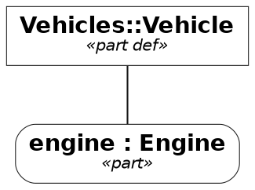
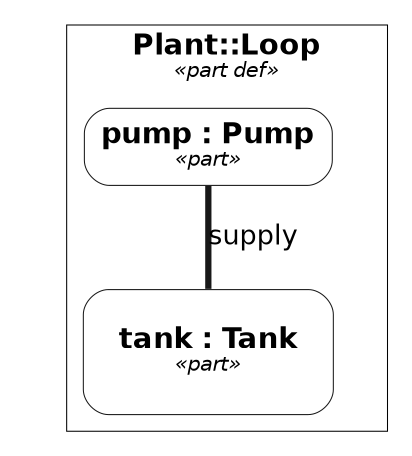

# View rendering forms — the view engine's writers

> **Labels.** This is an engineering record. "Track W" and its items (`W1`–`W3`) name entries of
> [the roadmap](roadmap.md), where each is stated in full; a reader who only wants the design can
> ignore them.

Status: **`text`, `markdown`, `mermaid` and `dot` implemented** — `dot` is Track W's `W1`, wired
into every surface `W3` names. `plantuml` (`W2`) is not written. This page records how a view's
rendering is separated from the forms it is written in, why Graphviz DOT is offered next to
Mermaid, and what the DOT writer emits — the [DiagramLayout](diagram-layout-annotations.md) geometry
included.

## The rendering and its forms

A view renders into a `view.Rendering` (`internal/core/view/view.go`): the kind (`tree`,
`interconnection`, `state`, `action`, `sequence`, `table`), typed nodes with an identifier, a
kind, a name, the declared type of a typed usage, an optional detail holding the notes (`initial`,
`already shown`, `own flow`) and their children, edges with a label and an `EdgeKind`
(connection, transition, succession, flow), a table's columns and rows, the origin of every node
and row, and notices for what the kind could not represent. The tree, interconnection, state and
action kinds are produced from the model — the last two from the lowered `StateGraph` and
`ActionGraph` the runtime executes — and nothing in the rendering is text of any diagram
language.

A **form** is a writer over that tree (`internal/core/view/form.go`):

| Form | Writer | Kinds | Role |
| --- | --- | --- | --- |
| `text` | `text.go` | every kind | What a person reads at a terminal |
| `markdown` | `markdown.go` | `table` | The machine-readable form of a table |
| `mermaid` | `mermaid.go` | `tree`, `interconnection`, `state`, `action`, `sequence` | The default machine-readable form of the graph-shaped kinds |
| `dot` | `dot.go` | `tree`, `interconnection`, `state`, `action` | Graphviz DOT, the alternative to Mermaid |

`Kind.MachineForm` chooses the form a tool gets when none is asked for — `markdown` for a table,
`mermaid` for everything else — and `Kind.SupportsForm` decides whether a kind can be written in
a form at all. Asking for a form the kind is not written in is one typed `WrongFormError`, naming
the kind, the form asked and the form the kind uses, on every surface: the CLI stops with status 2
(`-render-all` skips the view and says so), the REPL prints the usage, the LSP refuses the request,
and a document's `Diagram` block is refused at planning time.

## Node labels

Every graphical form draws a node's label the way the graphical notation heads a compartment:
the element's name first, the kind after it. `label.go` composes the lines once, and each writer
only joins them:

1. the name, with ` : Type` after it for a typed usage (`pump : Pump`); a definition has just its
   name; an anonymous element leads with its kind instead;
2. the kind in guillemets, `«part»`, `«state def»` — left out when line 1 is already the kind;
3. the detail, when there is one.

Mermaid joins the lines with `<br>` in every grammar it writes — a flowchart node label, a
`state "…" as n` and a `participant n as …` — which the pinned `mermaid-cli` breaks at whether
`htmlLabels` is on (the text becomes HTML, `<br>` a line break) or off (the label is split into
`<tspan>` rows); no `<br>` survives as text in the drawing. The tree, interconnection and action
kinds draw the same flowchart labels. A flowchart reserves one line of height for a `subgraph`
title and draws the first child over the rest, so a rendering whose cluster title spans several
lines opens on a YAML frontmatter block, `config: flowchart: subGraphTitleMargin: bottom: <n>`,
claiming 24px per extra line as the title's bottom margin (`writeFlowchartFrontmatter`); the
block rides the text into every consumer, and a flowchart without such a cluster, a tree, a
state diagram and a sequence diagram carry none. DOT writes an HTML-like label, `label=<<b>pump :
Pump</b><br/><font point-size="10">«part»</font>>`, the name in bold and the keyword line under
the 14pt Graphviz draws the rest in; `&`, `<`, `>` and `"` in a name become entities so no name
reads as markup. A cluster's label is the same string. The text form keeps the notation's
declaration order, `part pump : Pump`, with a detail parenthesised after it. The declared type is
a field of the node (`Node.Type`, `type` in the JSON), never parsed back out of the detail.

## Why DOT next to Mermaid

Mermaid was chosen first because it draws where models are read — Markdown, documentation sites,
editors — with nothing installed. It stays the default. DOT is offered beside it for what Mermaid
is not:

- **Graphviz toolchains.** Publishing pipelines that already run `dot`, `neato` or `fdp` take DOT
  as input and produce SVG, PDF or PNG with a layout Mermaid's browser renderer cannot match on a
  graph of hundreds of nodes.
- **Exact positions.** DOT has a native vocabulary for a node's position (`pos`), size and an
  edge's route, which Mermaid lacks. The writer fills it from the rendering's DiagramLayout
  geometry (below), so a view laid out in an editor is drawn by Graphviz where the editor put
  it; the Mermaid form can only carry the same numbers as `%%` comments.

Producing DOT needs **no Graphviz installation**. The writer is text over the rendering tree,
exactly as `mermaid.go` is, and nothing in the repository runs a Graphviz binary — not the writer,
not the tests, not the PDF backend.

## What the DOT writer emits



- **Header.** `// view: <name>` when a view was named, `// kind: <kind>`, `// stated: <how the
  kind was decided>` when the rendering records it, one `// not represented: <notice>` per
  notice — the same facts the Mermaid form writes as `%%` comments — and `// layout: dot`.
- **Graph.** `digraph "<view>"` (`digraph` alone for a pseudo-view), a `graph` statement with the
  font and `rankdir=<dir>` when a direction is asked for, the `node` and `edge` defaults of the
  [style](#style) below, and `compound=true` only when an edge ends at a cluster.
- **Nodes.** A leaf is `"<id>" [label=<<b><head></b><br/><font point-size="10"><i>«<kind>»</i></font><br/><detail>>]`,
  the [label lines above](#node-labels) as an HTML-like string, the detail line omitted when
  empty; a usage adds `style="rounded,filled"` before its label. In an interconnection, state or
  action rendering a node with children is
  `subgraph "cluster_<id>" { label=<…>; color=black; penwidth=<w>; … }`, the containment Mermaid writes as `subgraph`;
  in a tree, containment is an `arrowhead=none` edge, as the Mermaid tree draws it, so a tree has
  no clusters. Since DOT edges join nodes, not subgraphs, every cluster holds an invisible,
  sizeless anchor node named by the cluster's own ID; an edge whose end is a cluster names that
  anchor, so the rendering's endpoints survive verbatim, and is clipped at the cluster with
  `lhead`/`ltail` — except at an end that encloses the other, where the edge starts or ends
  inside it rather than at a border it never crosses.
- **State kind.** A state is a rounded box, a region a dashed cluster, the start pseudo-state a
  `point`, an initial state a `circle`, a final state a `doublecircle` — an unnamed initial or
  final one the filled black UML dot, a named one a labelled ring; a transition's label is the
  trigger/guard/effect text the state writer composes, unchanged.
- **Edges.** The `EdgeKind` styles parallel the Mermaid arrows so the two forms read alike:

  | `EdgeKind` | Mermaid | DOT |
  | --- | --- | --- |
  | connection | `---` | `arrowhead=none, penwidth=3` |
  | transition, succession | `-->` | solid, default arrowhead |
  | flow | `-.->` | `style=dashed` |

- **Quoting.** Every identifier, edge label and geometry value passes through one helper that
  double-quotes it and escapes `"`, `\` and newlines; a node or cluster label is an HTML-like
  string whose text passes through one helper that writes `&`, `<`, `>`, `"` and `'` as entities.
  The writer never emits an unquoted identifier or unescaped label text.
- **Order.** Nodes and edges are written in the rendering's order; nothing is emitted from a map.
  Within an attribute list, what a node *is* (shape, style, colours, label) precedes where it is
  (`pos`, `width`, `height`).

Three methods of the writer produce every attribute list — `graphAttributes`,
`dotNodeAttributes` (with `dotClusterAttributes` and `dotAnchorAttributes` for a node drawn as a
cluster) and `dotEdgeAttributes` — so what is said about a node or an edge changes without
touching how the graph is walked.

## Style

The DOT form is drawn in the **Standard B&W style** of the OMG SysML v2 Pilot Implementation's
PlantUML visualizer, after the `sysmlbw` PlantUML skin by Hisashi Miyashita (Mgnite Inc.) shipped
with it — `github.com/himi/plantuml`, branch `psysml`,
`bundles/net.sourceforge.plantuml.lib/skin/sysmlbw.skin` — and the edge rules of the Pilot's
`org.omg.sysml.plantuml/src/org/omg/sysml/plantuml/SysML2PlantUMLStyle.java`. The skin is
EPL-2.0; this project reproduces its visual parameters (colours, line widths, font choices) in
Graphviz's vocabulary, not its text. The Pilot's default is `skin sysmlbw`, `skinparam monochrome
true` and `hide circle`; the translation is:

| Skin / Pilot rule | DOT |
| --- | --- |
| `FontName SansSerif`, `FontSize 14`, `FontColor black` | `graph`, `node` and `edge` default `fontname="Helvetica"`, Graphviz's portable sans-serif; `fontsize=14` on nodes; text stays black |
| `BackGroundColor #ffffff`, `monochrome true` | node default `style=filled, fillcolor=white`; no other colour without a [palette](#palettes) |
| `LineColor #181818`, `element { LineThickness 0.5 }` | node default `color="#181818", penwidth=0.5` |
| `RoundCorner 0` for definitions, `UsageRoundCorner 20` for usages | a definition (`… def`, or a KerML classifier keyword) keeps `shape=box`; a usage adds `style="rounded,filled"`. Graphviz's corner radius is fixed, so the 20-unit radius is approximated |
| `stereotype { FontStyle italic }` | the `«keyword»` label line is `<i>…</i>` at its 10 pt size |
| `element { title { FontStyle bold } }` | the name line is `<b>…</b>` |
| `stateDiagram { element { title { FontStyle plain } } }` | not followed: a state's name stays bold, as in every other kind and in the text and Mermaid forms, so the four forms read alike |
| `group { BackGroundColor transparent; LineThickness 1.0 }`, `package { LineThickness 1.5; LineColor black }`, `stateDiagram { group { LineThickness 0.5 } }` | a cluster is unfilled with `color=black`; `penwidth=1.5` when its kind is a package, `penwidth=0.5` for a cluster standing for an element and for a region (which keeps `style=dashed`) |
| `arrow { FontSize 13; LineThickness 1.0 }` | edge default `color="#181818", fontsize=13, penwidth=1` |
| Pilot `caseConnectionUsage`, `caseConnector`: `-[thickness=3]-` | `EdgeConnection`: `arrowhead=none, penwidth=3` |
| Pilot `caseFlow`, `caseSuccession`, `caseTransitionUsage`: `-->` | the `EdgeKind` table above, unchanged |
| initial and final pseudo-states | the UML filled black dot: `shape=circle` (`doublecircle` for a final), `fillcolor=black`, `label=""`, `width=0.2` unless a Layout sizes it; a pseudo-state the rendering names keeps its labelled ring. The `start` point is unchanged |

Not translated, because Graphviz has no vocabulary for them: `Shadowing 0` (no shadows to turn
off), `hide circle` (no class circles), `wrapWidth 300` (DOT does not wrap label text), and the
20-unit corner radius. Out of scope: the skin's notes, sequence, gantt, mindmap and wbs
sections — the DOT form draws no notes and a sequence rendering has no DOT form — and the
Pilot's `-[thickness=5]-` binding connectors, which the interconnection rendering does not
distinguish from connections today (there is no `EdgeBinding` kind), so DOT cannot draw them
apart either; that is a known limitation, not an approximation.

### Palettes

A `view.Palette` fills the DOT form's nodes by **keyword family**, the way the Pilot's
`STDCOLOR` mode does, so a `part def` and a `part` share a hue. The empty palette is the B&W
default above. Every named palette is colourblind-safe:

| Name | Source | Colours |
| --- | --- | --- |
| `okabe-ito` | Okabe & Ito, *Color Universal Design* (2002, jfly.uni-koeln.de/color) | `#E69F00 #56B4E9 #009E73 #F0E442 #0072B2 #D55E00 #CC79A7 #999999` |
| `tol-bright` | Paul Tol, *Colour Schemes*, SRON technical note 3.2 (2021), personal.sron.nl/~pault | `#4477AA #EE6677 #228833 #CCBB44 #66CCEE #AA3377 #BBBBBB` |
| `tol-muted` | same note | `#332288 #88CCEE #44AA99 #117733 #999933 #DDCC77 #CC6677 #882255 #AA4499 #DDDDDD` |
| `tol-light` | same note | `#77AADD #99DDFF #44BB99 #BBCC33 #AAAA00 #EEDD88 #EE8866 #FFAABB #DDDDDD` |
| `brewer-set2` | ColorBrewer 2.0 Set2, Cynthia Brewer (colorbrewer2.org) | `#66C2A5 #FC8D62 #8DA0CB #E78AC3 #A6D854 #FFD92F #E5C494 #B3B3B3` |
| `brewer-dark2` | ColorBrewer 2.0 Dark2 | `#1B9E77 #D95F02 #7570B3 #E7298A #66A61E #E6AB02 #A6761D #666666` |
| `viridis` | matplotlib's viridis (van der Walt & Smith; CC0), 16 evenly spaced stops | `#440154 … #FDE725` |
| `cividis` | matplotlib's cividis (Nuñez, Anderton & Renslow 2018; CC0), 16 stops | `#00224E … #FEE838` |

ColorBrewer notice: Set2 and Dark2 are colour specifications and designs developed by Cynthia
Brewer (http://colorbrewer.org/), licensed under the Apache License, Version 2.0.

- **Families**, in fixed order: part, item, port, attribute, action, state, requirement,
  constraint, connection, interface, use case, case, allocation, analysis, verification, enum,
  occurrence, flow, then anything else. A kind is placed by the first of its words with a family
  (`perform action` is an action, `analysis case` an analysis), the `def` suffix set aside. The
  family's place in this order is its index into a qualitative palette, so a diagram with only
  parts and ports uses the palette's first and third colours whatever else is absent; a palette
  shorter than the families wraps round. A sequential palette (`viridis`, `cividis`) is instead
  sampled evenly across the families present in the rendering, darkest first.
- **Definitions and usages.** A definition takes the family colour as `fillcolor`; a usage a tint
  of it, blended 60 % toward white. Both borders are the untinted family colour at `penwidth=1`.
- **Contrast.** Text stays black. Every fill — definition or usage — is lightened toward white,
  a hundredth at a time, until black text on it reaches the WCAG 2 level-AA ratio of 4.5:1; a
  colour already legible is unchanged. One function (`paletteFill`) defines the blend, and a test
  asserts the ratio for every colour of every palette at both tints.
- **What stays black and white.** Pseudo-states, control nodes (fork, join, decision, …) and
  cluster borders keep the B&W rules under every palette; only plain nodes are filled.
- **Other forms.** Mermaid writes a `%% not represented: palette <name>; only the DOT form fills
  nodes by keyword family` comment and is not themed; text and Markdown ignore a palette
  silently. An unknown palette name is a typed `*view.UnknownPaletteError` (wrapping
  `view.ErrUnknownPalette`) naming the palettes there are, on every surface.

The palette API is shaped so a later caller can ask for the colour of category *i* of *n*
(`Palette.Color(i, n)`) without knowing about keyword families; colouring by a data attribute or
query result is not built.

## Geometry

A rendering carries the [DiagramLayout](diagram-layout-annotations.md) annotations of its view — a
`Rendering.Canvas`, a `Node.Geometry`, an `Edge.Route` — in the library's units: pixels,
y down, origin at the canvas's top-left corner. Graphviz reads points, y up, from the
bottom-left; the writer converts, so the DOT it writes is laid out by Graphviz without a
preprocessing step:



- **Scale.** One pixel is one point: `inputscale=72` tells `neato` that `pos` is in points, and
  `dpi=72` keeps the rendered pixel at that size. Lengths Graphviz takes in inches — a node's
  `width`/`height` — are divided by 72.
- **Axis.** `y` is flipped: measured up from the canvas's bottom edge (`height - y`) when the
  canvas states a height, negated when it does not. `x` is unchanged.
- **Canvas.** A `Canvas` is echoed in the header as `// canvas: unit=<u> w=<w> h=<h>` (the
  parts it states). When it has an extent and a node is positioned, an invisible, sizeless
  point is pinned at each of its corners — `"canvas:0"` at the origin, `"canvas:1"` at
  `(w, h)` — so the drawing's bounding box is the canvas, not the hull of the nodes: Graphviz
  recomputes the root `bb` and ignores a `size` larger than the drawing, but it keeps a pinned
  node where it is. The names cannot collide with a rendering's `n<i>` node IDs.
- **Nodes.** A `Layout` names the box's top-left corner; Graphviz positions a node's centre, so
  the writer pins `pos="x,y!"` at the centre of the box and `pin=true` keeps `neato` from
  moving it. A stated size is `width`/`height` in inches with `fixedsize=true`. Without one
  the writer sizes the box to the label itself — 0.6 em a glyph (0.66 em in the bold head),
  1.2 em a line, at 14 pt for every line but the 10 pt keyword line, Graphviz's margins, no
  smaller than its 54×36 pt default box, a circle round the label for a
  pseudo-state, a 3.6 pt point for a start — and writes that `width`/`height` without
  `fixedsize`, so Graphviz may still grow the box for its own font but the corner is where the
  Layout put it under the writer's estimate. `collapsed` is kept as `comment="collapsed"`, an
  attribute Graphviz ignores and a consumer can read.
- **Clusters.** A node drawn as a cluster writes its box as `bb="llx,lly,urx,ury"` and pins
  its anchor node at the box's centre. The box is the stated one, or, with a corner alone, the
  one from that corner round its positioned members' boxes with Graphviz's 8 pt cluster margin;
  a cluster with neither has no box to state and pins its anchor at the corner.
- **Edges.** A `Route` becomes `pos` as the cubic B-spline Graphviz reads: each segment's ends
  are its own control points, so the spline is the polyline through the waypoints. A route of
  one waypoint draws no line; it is left out and noticed as `// not represented:`.
- **Engine.** The `// layout:` header names the command that honours what is written:
  `neato -n2` when every node is positioned and any edge is routed (the pinned nodes and the
  written routes are taken as given, the other edges are drawn), `neato -n` when every node is
  positioned and no edge is routed, `neato` when only some nodes are (pinned nodes stay, the
  rest are placed around them), `dot` when none is. `neato` and `dot` redraw every edge, so
  when the header names either and a route was written, a `// not represented:` notice says
  so. A rendering with no geometry is written byte for byte as before.

The writer is still text over the tree: no Graphviz binary is run to produce, check or test
the output.

## Surfaces

`dot` is accepted wherever a form is chosen:

| Surface | Where | Documentation |
| --- | --- | --- |
| CLI | `-render <view> -render-form dot`; `-render-all <dir> -render-form dot` writes `.dot` files; `-render-palette <name>` fills them | [`docs/reference/cli.md`](../reference/cli.md#rendering-a-view) |
| REPL | `%render <view> dot [palette]`; `%help` names it | [`docs/reference/repl-commands.md`](../reference/repl-commands.md#rendering-a-view) |
| LSP | `"form": "dot"` and `"palette": "<name>"` on `opensysml/render` | [`docs/reference/lsp.md`](../reference/lsp.md) |
| Documents | `-render-document`/`-render-documents … -diagram-form dot`, `%render-document <name> dot`, `"diagramForm": "dot"` on `opensysml/renderDocument`: every graph-shaped diagram block as a ` ```dot ` fence in Markdown, `<pre class="dot">` in HTML, the source under a notice in PDF. The form is chosen at render time, not stated in the model: a `Diagram` block says what is drawn, not the notation — though it may state a `palette`, as it states a `direction`, which the DOT figure is filled with and the HTML figure carries as `data-palette` | [`docs/manual/authoring.md`](../manual/authoring.md#diagrams), [`docs/manual/outputs.md`](../manual/outputs.md) |

The gRPC service (`api/proto/sysml.proto`, `internal/grpc`) has no view-render RPC and no
render-form field — `RenderDocument` alone, to Markdown — so the wire contract carries no form
and did not change. A view-render RPC added later would take the form as a string, as
`-render-form` does.

## Test contract

- `internal/core/view/dot_test.go`: a `*.dot.golden` beside every Mermaid golden for the tree,
  interconnection, state, state-entry, action and filtered fixtures, each walked by an in-test
  DOT syntax check — balanced braces, every edge endpoint declared as a node or a cluster,
  every identifier quoted — so a golden is proven well-formed without shelling out to `dot`;
  the wrong-form errors for `sequence` and `table`; quoting of names holding `"` and `\`;
  nested clusters and tree containment; every direction and the empty one; every `EdgeKind`;
  the state shapes and labels; the empty rendering and its notices. The geometry has
  `layout.dot.golden` beside the Mermaid and text goldens of the same fixture, the flipped axis
  with and without a canvas height, the centring and label-fitted size of unsized nodes, sized
  and pseudo-state nodes, the `bb` and pinned anchor of a stated, a member-fitted and a
  corner-only cluster, a route's spline and the one-waypoint notice, the zero-extent canvas,
  and the header's engine for none, some and all of the nodes positioned and all edges routed;
  the syntax check parses every `pos` and `bb` it meets, and reads an HTML-like label as one
  string whose tags balance and whose entities are known.
- `internal/core/view/dot_style_test.go`, `palette_test.go`: the B&W defaults; a definition
  square and a usage rounded; the pseudo-state rules named and unnamed, placed and not; the
  package, element and region cluster widths; the connection's `penwidth=3`; the family of every
  kind and the stability of the family order; the contrast ratio of every palette colour at both
  tints; the sequential sampling; the unknown-palette error text; the Mermaid notice and the
  silence of the text and Markdown forms; labels holding `&`, `<`, `>`, `"`, `'` and newlines;
  and the `interconnection.okabe-ito`, `state.okabe-ito` and `tree.viridis` goldens.
- `internal/core/view/label_test.go`, `render_test.go`: the label lines of a typed usage, an
  untyped usage, a definition, an anonymous node and a node with notes; the text form's
  keyword-leading line; the same `<br>`-joined label in the flowchart, state and sequence
  Mermaid grammars; the escaping of `<`, `>`, `"` and `#` in a Mermaid label.
- `cmd/sysml/render_test.go`, `internal/repl/view_render_test.go`, `internal/lsp/render_test.go`:
  the form on each surface, and its refusal for a table or sequence; the palette accepted, noted
  by Mermaid, and refused by name with the palettes there are.
- `internal/core/docplan`, `docir`, `docrender`: the `Diagram` block's `palette` accepted,
  refused when unknown (`invalid-palette`) or stated on a kind with no DOT form
  (`unsupported-palette`), carried into the document IR and onto the DOT and HTML figures.
- `internal/core/docrender`, `docpdf`, `cmd/sysml`, `internal/repl`, `internal/lsp`: the
  render-time diagram form defaulting to Mermaid, written as a `dot` fence and a
  `<pre class="dot">` for every graph-shaped block with tables left as tables, refused for an
  unknown form and for a kind with no DOT form, and kept as source in the PDF without a
  diagram tool being looked for.

## Known limitations

- A `Route` is written as the polyline through its waypoints; the writer does not smooth it
  into a curve, and Graphviz draws it as given.
- The PDF backend does not draw a DOT diagram. It keeps the source readable under a notice,
  and looks for no Graphviz tool.
- A `sequence` rendering has no DOT form. DOT has no sequence-diagram vocabulary; the Mermaid
  `sequenceDiagram` form remains the only machine-readable one.
- Node shapes are not yet specialised for action control nodes (fork, join, decision): those
  take the default box with their kind in the label.
- Graphviz has no corner radius, shadow or text wrapping, so the skin's `UsageRoundCorner 20`,
  `Shadowing 0` and `wrapWidth 300` are approximated or dropped as the [style](#style) section
  records.
- Binding connectors are not drawn at the Pilot's thickness 5: the interconnection rendering
  has no edge kind for them.
- A palette fills nodes by keyword family only; colouring by a data attribute or query result,
  and Mermaid theming, are not built.
- Producing DOT still runs no Graphviz binary. The goldens are checked by the in-test syntax
  walk; a Graphviz installation is used only by hand to look at them.
