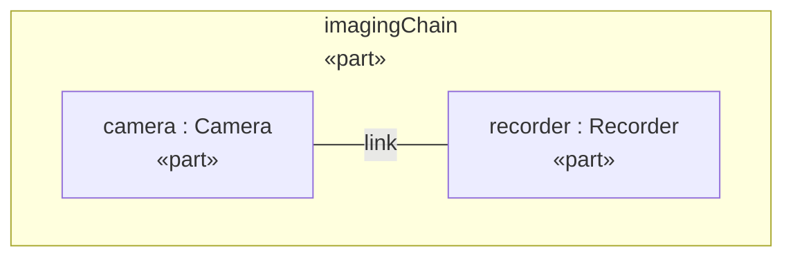
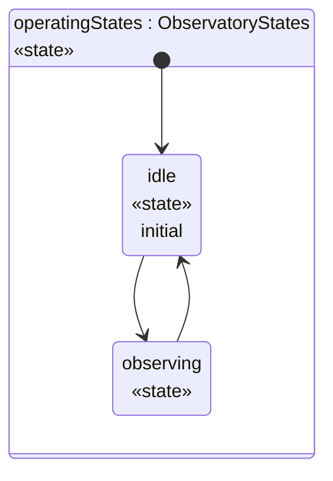

# Telescope Mass Report

Mass rollup for the telescope assembly. Masses are in kg \| not \#grams, \*not\* \_lbs\_, \`raw\`, \<b>\&plain\</b>.

Reading order: *em\*ph\*asis* **bold\_move** `` mass >= `limit` `` [the \[spec\]](<https://example.com/spec(v2).md>) [Subsystem Masses \| by \*name\*](#breakdown) [the zone groups](#zones)

*Subsystems grouped by zone*

**zone: support \| \*frame\***

| zone | name | mass |
| --- | --- | --- |
| support \| \*frame\* | baffle\|shroud \*tricky\* | 1.5 |
| support \| \*frame\* | mount | 15 |

**zone: payload**

| zone | name | mass |
| --- | --- | --- |
| payload | optics | 8.5 |
| payload | segmentControl | 20 |

## Subsystem Masses \| by \*name\*

*All subsystems by mass*

| name | mass |
| --- | --- |
| baffle\|shroud \*tricky\* | 1.5 |
| mount | 15 |
| optics | 8.5 |
| segmentControl | 20 |

*Mass margins (allocated - estimated)*

| name | label | margin |
| --- | --- | --- |
| baffle\|shroud \*tricky\* | subsystem: baffle\|shroud \*tricky\* | -1.5 |
| mount | subsystem: mount | 0 |
| optics | subsystem: optics | 1.5 |
| segmentControl | subsystem: segmentControl | 5.5 |

*Subsystem notes*

| shortName | name | documentation |
| --- | --- | --- |
|  | baffle\|shroud \*tricky\* |  |
| M3\|\* | mount |  |
| M1 | optics | The primary mirror assembly., Collects light \| not \*heat\* from the target. |
|  | segmentControl | Actuators that phase the mirror segments. |

**M3\|\***

**M1** — The primary mirror assembly. Collects light \| not \*heat\* from the target.

Actuators that phase the mirror segments.

### Heavy Subsystems

mount segmentControl

1. mount
2. segmentControl

**mount** [mount](<https://example.com/parts#mount>) **segmentControl** [segmentControl](<https://example.com/parts#segmentControl>)

- `mount`
- `segmentControl`

### Missing Subsystems

| name | mass |
| --- | --- |

## Diagrams

*Imaging chain interconnection*

*Observatory states, left to right*

## Declared Types

The declared type of the telescope, by relationship traversal.

*Type of telescope*

| element |
| --- |
| Assembly \*frame\* |

- Assembly \*frame\*
